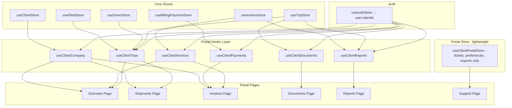

# Design Document: Client Portal Redesign

## Overview

This design replaces the isolated `useClientPortalStore` — which currently holds hardcoded US-location dummy data for shipments, invoices, and documents — with a thin integration layer that reads from the existing core Zustand stores (`useTripStore`, `useInvoiceStore`, `useBillingPaymentStore`, `useClientStore`) filtered by the authenticated client's `clientId`. The portal retains a lightweight store only for portal-specific entities (support tickets, report exports, notification preferences) that have no counterpart in the admin system.

All data presented in the portal uses Philippine-realistic seed data (Filipino names, PH addresses, ₱ currency in `en-PH` locale, `Asia/Manila` timezone). The UI is rebuilt with shadcn/ui components (Card, Table, Badge, Dialog, Tabs, Select) using brand colors (teal `#66B2B2`, navy `#0B1220`) and consistent spacing patterns.

### Key Design Decisions

| Decision | Rationale |
|----------|-----------|
| Custom hooks as integration layer | Encapsulates filtering logic (`useClientTrips`, `useClientInvoices`, etc.) so page components stay simple and testable |
| Keep portal-specific store for tickets/preferences | Support tickets are portal-only entities with no admin-side equivalent |
| No BFF or API layer | Data lives in Zustand stores (client-side demo); filtering happens in custom hooks |
| shadcn/ui Tabs for portal nav | Consistent with platform patterns; provides accessible keyboard navigation out-of-box |
| Seed data augmentation over new stores | Add PH-realistic trips/invoices for `c-001` to existing seed files rather than creating parallel data |

---

## Architecture



### Data Flow

1. **Authentication**: `useAuthStore` provides `user.clientId` (e.g., `"c-001"`)
2. **Hook Layer**: Custom hooks (`useClientTrips`, `useClientInvoices`, etc.) read from global stores and return `useMemo`-filtered data for the authenticated client
3. **Page Components**: Consume hook data, apply local UI state (search, status filter, selected item), and render with shadcn/ui components
4. **Portal Store**: Only used for support tickets, report exports, and notification preferences

---

## Components and Interfaces

### Custom Hooks (new: `lib/hooks/client-portal/`)

```typescript
// lib/hooks/client-portal/use-client-trips.ts
export function useClientTrips() {
  const user = useAuthStore((s) => s.user);
  const trips = useTripStore((s) => s.trips);
  const drivers = useDriverStore((s) => s.drivers);
  const vehicles = useFleetStore((s) => s.vehicles);

  const clientTrips = useMemo(
    () => trips.filter((t) => t.clientId === user?.clientId),
    [trips, user?.clientId]
  );

  // Enrichment: resolve driverName and vehiclePlate
  const enrichedTrips = useMemo(() =>
    clientTrips.map((trip) => ({
      ...trip,
      driverName: drivers.find((d) => d.id === trip.driverId)?.name ?? "Unassigned",
      vehiclePlate: vehicles.find((v) => v.id === trip.vehicleId)?.plate ?? "—",
    })),
    [clientTrips, drivers, vehicles]
  );

  return { trips: enrichedTrips, total: enrichedTrips.length };
}
```

```typescript
// lib/hooks/client-portal/use-client-invoices.ts
export function useClientInvoices() {
  const user = useAuthStore((s) => s.user);
  const invoices = useInvoiceStore((s) => s.invoices);

  const clientInvoices = useMemo(
    () => invoices.filter((i) => i.clientId === user?.clientId),
    [invoices, user?.clientId]
  );

  return { invoices: clientInvoices };
}
```

```typescript
// lib/hooks/client-portal/use-client-payments.ts
export function useClientPayments() {
  const user = useAuthStore((s) => s.user);
  const payments = useBillingPaymentStore((s) => s.payments);

  const clientPayments = useMemo(
    () => payments.filter((p) => p.clientId === user?.clientId),
    [payments, user?.clientId]
  );

  return { payments: clientPayments };
}
```

```typescript
// lib/hooks/client-portal/use-client-company.ts
export function useClientCompany() {
  const user = useAuthStore((s) => s.user);
  const clients = useClientStore((s) => s.clients);

  const company = useMemo(
    () => clients.find((c) => c.id === user?.clientId) ?? null,
    [clients, user?.clientId]
  );

  return company;
}
```

```typescript
// lib/hooks/client-portal/use-client-kpis.ts
export function useClientKpis() {
  const { trips } = useClientTrips();
  const { invoices } = useClientInvoices();

  return useMemo(() => {
    const inTransitStatuses = ["in_transit", "loaded", "vehicle_dispatched"];
    const deliveredStatuses = ["delivered", "completed"];

    return {
      totalShipments: trips.length,
      inTransit: trips.filter((t) => inTransitStatuses.includes(t.status)).length,
      delivered: trips.filter((t) => deliveredStatuses.includes(t.status)).length,
      outstandingBalance: invoices
        .filter((i) => i.balance > 0)
        .reduce((sum, i) => sum + i.balance, 0),
    };
  }, [trips, invoices]);
}
```

### Utility Functions (new: `lib/utils/client-portal.ts`)

```typescript
// Status label mapping
export const TRIP_STATUS_LABELS: Record<TripStatus, string> = {
  scheduled: "Scheduled",
  driver_assigned: "Driver Assigned",
  vehicle_dispatched: "Dispatched",
  loaded: "Loaded",
  in_transit: "In Transit",
  delivered: "Delivered",
  completed: "Completed",
  delayed: "Delayed",
  cancelled: "Cancelled",
};

// Badge color mapping (consistent across all portal pages)
export const STATUS_BADGE_VARIANT: Record<string, string> = {
  delivered: "bg-emerald-100 text-emerald-700",
  completed: "bg-emerald-100 text-emerald-700",
  in_transit: "bg-blue-100 text-blue-700",
  loaded: "bg-blue-100 text-blue-700",
  vehicle_dispatched: "bg-blue-100 text-blue-700",
  scheduled: "bg-gray-100 text-gray-700",
  delayed: "bg-amber-100 text-amber-700",
  cancelled: "bg-red-100 text-red-700",
  paid: "bg-emerald-100 text-emerald-700",
  sent: "bg-blue-100 text-blue-700",
  overdue: "bg-red-100 text-red-700",
  partially_paid: "bg-amber-100 text-amber-700",
  draft: "bg-gray-100 text-gray-700",
  open: "bg-amber-100 text-amber-700",
  in_progress: "bg-blue-100 text-blue-700",
  resolved: "bg-emerald-100 text-emerald-700",
};

// Document category mapping
export const DOCUMENT_CATEGORIES = {
  Delivery: ["Bill of Lading", "Delivery Receipt", "Proof of Delivery"],
  Compliance: ["Certificate of Insurance", "Permits", "OR/CR"],
  Financial: ["BIR 2307", "Statement of Account", "Official Receipt"],
  Rate: ["Rate Confirmation"],
} as const;

export type DocumentCategory = keyof typeof DOCUMENT_CATEGORIES;

// "New" badge threshold — 48 hours in milliseconds
export function isDocumentNew(uploadedAt: string): boolean {
  const FORTY_EIGHT_HOURS_MS = 48 * 60 * 60 * 1000;
  return Date.now() - new Date(uploadedAt).getTime() < FORTY_EIGHT_HOURS_MS;
}

// On-time delivery rate computation
export function computeOnTimeRate(trips: Trip[]): number {
  const delivered = trips.filter((t) =>
    ["delivered", "completed"].includes(t.status)
  ).length;
  const eligible = trips.filter((t) =>
    !["scheduled", "cancelled"].includes(t.status)
  ).length;
  if (eligible === 0) return 0;
  return (delivered / eligible) * 100;
}

// Top lanes computation
export function computeTopLanes(trips: Trip[]): { route: string; count: number }[] {
  const laneCounts = new Map<string, number>();
  for (const trip of trips) {
    const route = `${trip.pickup.address.split(",")[0]} → ${trip.dropoff.address.split(",")[0]}`;
    laneCounts.set(route, (laneCounts.get(route) ?? 0) + 1);
  }
  return Array.from(laneCounts.entries())
    .map(([route, count]) => ({ route, count }))
    .sort((a, b) => b.count - a.count);
}

// Multi-criteria filter helper
export function filterBySearchAndStatus<T>(
  items: T[],
  query: string,
  statusFilter: string | "all",
  getStatus: (item: T) => string,
  getSearchFields: (item: T) => string[]
): T[] {
  const q = query.trim().toLowerCase();
  return items.filter((item) => {
    const matchesStatus = statusFilter === "all" || getStatus(item) === statusFilter;
    const matchesSearch = !q || getSearchFields(item).some((f) => f.toLowerCase().includes(q));
    return matchesStatus && matchesSearch;
  });
}
```

### Refactored Portal Store (slimmed `lib/store/client-portal.ts`)

The portal store retains **only** portal-specific entities:

```typescript
interface ClientPortalState {
  // Portal-only entities (no core store equivalent)
  tickets: PortalTicket[];
  exports: PortalReportExport[];
  preferences: PortalPreferences;

  addTicket: (payload: Omit<PortalTicket, "id" | "createdAt" | "updatedAt" | "messageCount" | "status">) => void;
  updateTicketStatus: (ticketId: string, status: PortalTicketStatus) => void;
  addReportExport: (reportName: string, format: "CSV" | "PDF") => void;
  updatePreferences: (patch: Partial<PortalPreferences>) => void;
  reset: () => void;
}
```

Removed from the portal store: `shipments`, `documents`, `invoices`, `markInvoicePaid`.

### Portal Layout (`app/(app)/client-portal/layout.tsx`)

```typescript
"use client";
import { Tabs, TabsList, TabsTrigger } from "@/components/ui/tabs";
import { usePathname, useRouter } from "next/navigation";
import { useClientCompany } from "@/lib/hooks/client-portal/use-client-company";

const TABS = [
  { value: "overview", label: "Overview", href: "/client-portal/overview" },
  { value: "shipments", label: "Shipments", href: "/client-portal/shipments" },
  { value: "invoices", label: "Invoices", href: "/client-portal/invoices" },
  { value: "documents", label: "Documents", href: "/client-portal/documents" },
  { value: "reports", label: "Reports", href: "/client-portal/reports" },
  { value: "support", label: "Support", href: "/client-portal/support" },
];

export default function ClientPortalLayout({ children }) {
  const pathname = usePathname();
  const router = useRouter();
  const company = useClientCompany();
  const activeTab = TABS.find((t) => pathname.startsWith(t.href))?.value ?? "overview";

  return (
    <div className="space-y-6 pb-10">
      <div>
        <h1 className="text-3xl font-extrabold text-[#0B1220] tracking-tight">Client Portal</h1>
        {company && (
          <p className="text-sm text-muted-foreground mt-1">
            {company.name} — {company.contactPerson}
          </p>
        )}
      </div>
      <Tabs value={activeTab} onValueChange={(v) => {
        const tab = TABS.find((t) => t.value === v);
        if (tab) router.push(tab.href);
      }}>
        <TabsList>
          {TABS.map((tab) => (
            <TabsTrigger key={tab.value} value={tab.value}>
              {tab.label}
            </TabsTrigger>
          ))}
        </TabsList>
      </Tabs>
      {children}
    </div>
  );
}
```

### Page Component Patterns

Each page follows this pattern:

1. Import custom hook(s) for data
2. Apply local UI state (search query, status filter, selected item)
3. Use `filterBySearchAndStatus` utility for combined filtering
4. Render with shadcn/ui components (Table, Card, Badge, Dialog, Select)
5. Use `formatCurrency` for all ₱ amounts
6. Use `STATUS_BADGE_VARIANT` for consistent badge colors

---

## Data Models

### Existing Core Models (unchanged)

| Model | Store | Key Fields |
|-------|-------|------------|
| `Trip` | `useTripStore` | `id`, `clientId`, `pickup`, `dropoff`, `cargo`, `status`, `statusLogs`, `createdAt`, `driverId`, `vehicleId` |
| `Invoice` | `useInvoiceStore` | `id`, `clientId`, `invoiceNumber`, `items[]`, `subtotal`, `vatRate`, `vatAmount`, `totalAmount`, `paidAmount`, `balance`, `status` |
| `BillingPayment` | `useBillingPaymentStore` | `id`, `clientId`, `invoiceId`, `amount`, `method`, `status`, `paymentDate` |
| `Client` | `useClientStore` | `id`, `name`, `contactPerson`, `email`, `phone`, `address`, `industry` |

### Portal-Only Models (retained in slimmed store)

| Model | Description |
|-------|-------------|
| `PortalTicket` | Support ticket with `subject`, `details`, `category`, `priority`, `status`, `shipmentRef?`, `invoiceRef?` |
| `PortalReportExport` | Export history: `reportName`, `format`, `generatedAt` |
| `PortalPreferences` | Notification preferences: email toggles, weekly summary, default report format |

### New Portal Document Model

Documents in the portal are derived from trip data + a portal-specific document seed (since the core system doesn't have a per-client document store). The portal document model:

```typescript
export interface PortalDocument {
  id: string;
  name: string;
  type: "PDF" | "DOCX" | "XLSX";
  category: DocumentCategory; // "Delivery" | "Compliance" | "Financial" | "Rate"
  uploadedAt: string;
  uploadedBy: string; // Filipino name
  tripId?: string; // Reference to client's trip
  sizeKb: number;
  notes?: string;
}
```

### Seed Data Augmentation

The existing seed data already includes:
- 3 trips with `clientId: "c-001"` (PH addresses, Manila/Pampanga routes)
- 1 invoice with `clientId: "c-001"` (₱245,760.00)
- 2 billing payments for `c-001`
- Client `c-001` = "ABC Construction Inc." / "Engr. Robert Lim"

Additional seed data needed:
- 5+ more trips for `c-001` with varied statuses (in_transit, delivered, scheduled, delayed)
- 3+ more invoices for `c-001` with statuses (paid, sent, overdue, partially_paid)
- Portal documents seed with Filipino names and PH document types
- Portal tickets seed with PH-realistic scenarios (EDSA delay, MICT congestion)

---

## Correctness Properties

*A property is a characteristic or behavior that should hold true across all valid executions of a system — essentially, a formal statement about what the system should do. Properties serve as the bridge between human-readable specifications and machine-verifiable correctness guarantees.*

### Property 1: Client data filtering correctness

*For any* collection of trips (or invoices, or payments) with various `clientId` values, and *for any* given `clientId`, filtering that collection by `clientId` SHALL return exactly the items where `item.clientId === clientId` — no matching items are excluded and no non-matching items are included.

**Validates: Requirements 1.1, 1.2, 1.3, 5.1, 6.1**

### Property 2: Currency formatting produces valid PHP format

*For any* finite numeric amount (including zero, negative values, and decimal values), `formatCurrency(amount)` SHALL produce a string beginning with `₱` that represents the amount in `en-PH` locale with exactly 2 decimal places.

**Validates: Requirements 3.1, 3.4, 6.5**

### Property 3: Date formatting uses Asia/Manila timezone

*For any* valid ISO-8601 timestamp, formatting it with `Asia/Manila` timezone SHALL produce a date string that reflects the UTC+8 offset (i.e., the rendered date matches the calendar date at UTC+8, not UTC).

**Validates: Requirements 3.2**

### Property 4: Status count computation accuracy

*For any* set of trips belonging to a client, and *for any* subset of statuses (e.g., `["in_transit", "loaded", "vehicle_dispatched"]`), the computed count SHALL equal the number of trips whose status is in that subset.

**Validates: Requirements 4.2, 4.3**

### Property 5: Outstanding balance aggregation

*For any* set of invoices belonging to a client, the computed outstanding balance SHALL equal the sum of `invoice.balance` for all invoices where `balance > 0`.

**Validates: Requirements 4.4**

### Property 6: Recent items sort order

*For any* set of trips, selecting the 5 most recent by `createdAt` descending SHALL produce a list where each item's `createdAt` is greater than or equal to the next item's `createdAt`, and the list length is `min(5, total trips)`.

**Validates: Requirements 4.5**

### Property 7: Trip status label mapping completeness

*For any* valid `TripStatus` value, the `TRIP_STATUS_LABELS` mapping SHALL return a non-empty string label.

**Validates: Requirements 5.2**

### Property 8: Multi-criteria filter correctness

*For any* collection of items, *for any* status filter value, and *for any* search query string, the filtered result SHALL contain only items that match both the status predicate (or all items if filter is "all") AND contain the query substring in at least one searchable field.

**Validates: Requirements 5.4, 6.4, 11.3**

### Property 9: Invoice VAT calculation integrity

*For any* invoice, `vatAmount` SHALL equal `subtotal × vatRate` (within floating-point tolerance of 0.01), and `totalAmount` SHALL equal `subtotal + vatAmount`.

**Validates: Requirements 6.2**

### Property 10: Badge color mapping completeness

*For any* valid status string used in the portal (trip statuses, invoice statuses, ticket statuses), the `STATUS_BADGE_VARIANT` mapping SHALL return a defined CSS class string (not undefined).

**Validates: Requirements 7.5, 13.2**

### Property 11: Active tab determination by URL path

*For any* valid portal sub-path (e.g., `/client-portal/shipments`, `/client-portal/invoices`), the active tab determination logic SHALL return the tab whose `href` prefix-matches the current path.

**Validates: Requirements 10.2**

### Property 12: Document categorization completeness

*For any* document with a `name` matching one of the defined document types, the categorization function SHALL assign it to exactly one valid `DocumentCategory`.

**Validates: Requirements 11.2**

### Property 13: New badge time threshold

*For any* document `uploadedAt` timestamp, `isDocumentNew(uploadedAt)` SHALL return `true` if and only if the time elapsed since upload is less than 48 hours (172,800,000 ms).

**Validates: Requirements 11.5**

### Property 14: Route grouping aggregation

*For any* set of trips, `computeTopLanes(trips)` SHALL produce groups where the sum of all group counts equals the total number of trips, and groups are sorted in descending order by count.

**Validates: Requirements 12.2**

### Property 15: On-time delivery rate formula

*For any* set of trips, `computeOnTimeRate(trips)` SHALL equal `(count of trips with status in ["delivered", "completed"]) / (count of trips with status NOT in ["scheduled", "cancelled"]) × 100`. If the denominator is 0, the result SHALL be 0.

**Validates: Requirements 12.4**

### Property 16: Ticket-trip status join correctness

*For any* support ticket that references a `tripId`, and *for any* current state of the trip store, the displayed trip status alongside the ticket SHALL equal the trip's current `status` field (not a stale cached value).

**Validates: Requirements 13.3**

---

## Error Handling

| Scenario | Handling |
|----------|----------|
| `user.clientId` is undefined/null | Custom hooks return empty arrays; layout shows "No client linked" message |
| Client record not found in `useClientStore` | `useClientCompany` returns `null`; layout omits company name subtitle |
| Zero trips/invoices for client | KPI cards show `0` / `₱0.00`; tables show empty state with "No data" message |
| Invalid date string in `createdAt` / `uploadedAt` | Date formatting falls back to raw string display |
| `formatCurrency` fails (invalid locale) | Catch block returns `₱{amount.toLocaleString()}` (already implemented in brand config) |
| Portal store localStorage corrupted | Zustand persist middleware handles rehydration failure gracefully; falls back to seed data |

---

## Testing Strategy

### Property-Based Tests (fast-check)

The project will use **fast-check** as the PBT library for TypeScript. Each correctness property maps to one property-based test with minimum 100 iterations.

**Test file**: `__tests__/client-portal/properties.test.ts`

Configuration:
- Library: `fast-check` (npm package)
- Minimum runs: 100 per property
- Tag format: `// Feature: client-portal-redesign, Property {N}: {title}`

Properties to implement:
1. Client data filtering (generates random items with random clientIds)
2. Currency formatting (generates random numbers including edge cases)
3. Date timezone formatting (generates random ISO timestamps)
4. Status count computation (generates random trip arrays with random statuses)
5. Outstanding balance aggregation (generates random invoice arrays)
6. Recent items sort order (generates random trip arrays with random dates)
7. Trip status label mapping (generates all valid TripStatus values)
8. Multi-criteria filter (generates random arrays + random filters)
9. Invoice VAT calculation (generates random subtotals and rates)
10. Badge color mapping (generates all valid status strings)
11. Active tab by URL path (generates valid portal paths)
12. Document categorization (generates documents with known types)
13. New badge time threshold (generates random timestamps)
14. Route grouping (generates random trip arrays with addresses)
15. On-time delivery rate (generates random trip status arrays)
16. Ticket-trip status join (generates tickets referencing random trips)

### Unit Tests (Vitest)

- Specific example tests for seed data validation (c-001 has PH data)
- Component rendering tests (overview page renders KPIs)
- Redirect behavior (`/client-portal` → `/client-portal/overview`)
- Overdue invoice renders red indicator
- Portal store retains only tickets/preferences/exports

### Integration Tests

- Full page render with mock stores pre-populated
- Navigation between tabs updates URL and content
- Search + filter combination produces expected results
- Ticket creation references valid trip IDs

### Accessibility Tests

- Focus indicators present on interactive elements
- `aria-label` on icon-only buttons
- Table `scope` attributes
- Color contrast WCAG AA compliance (automated via axe-core)
