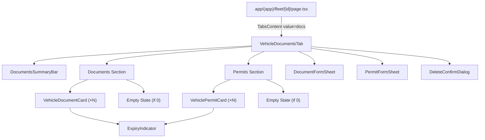
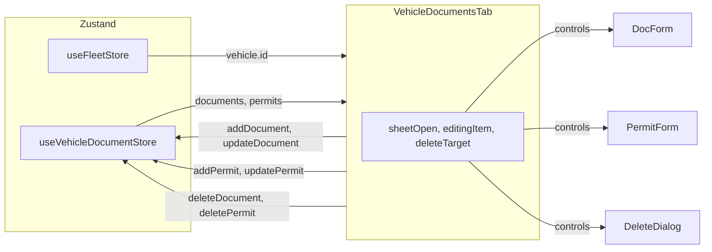

# Design Document: Fleet Vehicle Documents & Permits

## Overview

This feature replaces the empty placeholder in the "Documents" tab of the vehicle detail page (`app/(app)/fleet/[id]/page.tsx`) with a fully functional CRUD interface for managing Philippine logistics-specific vehicle documents and permits. The implementation introduces a dedicated Zustand store with persistence, Sheet-based form components for create/edit operations, expiry tracking with color-coded badges, and realistic seed data for demo purposes.

### Key Design Decisions

1. **New dedicated Zustand store** — `useVehicleDocumentStore` lives in its own file (`lib/store/vehicle-documents.ts`) to avoid bloating the main store index. Exported via `lib/store/index.ts` for consistency.
2. **Inline tab content** — The Documents tab content is extracted into a `components/fleet/VehicleDocumentsTab.tsx` component, imported by the existing detail page. This keeps the page file manageable.
3. **Sheet-based forms** — Follows the app's existing pattern (PMS Schedule Modal uses Sheet). Document and Permit forms share structural similarity but are separate components to handle their distinct fields (Coverage Area for permits).
4. **No new dependencies** — Uses existing shadcn/ui (Sheet, Card, Badge, Button, Dialog, Select, Input), react-hook-form, zod, sonner, and lucide-react.
5. **Simulated file upload** — No server interaction. File metadata is captured from a native file input and stored as a JSON object in the store.
6. **Surgical scope** — Only files directly required are created or modified. The existing page gets a single-line replacement of the docs tab placeholder.

---

## Architecture

### Component Tree



### Data Flow



### State Management Strategy

| State | Location | Rationale |
|-------|----------|-----------|
| Vehicle documents & permits | `useVehicleDocumentStore` (Zustand, persisted) | Global, shared, persistent |
| Vehicle data | `useFleetStore` (Zustand, persisted) | Existing global reference data |
| Sheet open state | `useState` local to VehicleDocumentsTab | Ephemeral UI state |
| Editing record reference | `useState` local | Controls add vs. edit mode |
| Delete confirmation target | `useState` local | Controls dialog state |
| Form field values | react-hook-form local state | Form-scoped, per interaction |

---

## Components and Interfaces

### `components/fleet/VehicleDocumentsTab.tsx`

The root component rendered inside `TabsContent value="docs"`. Orchestrates document/permit listing, summary bar, and form/dialog states.

```typescript
interface VehicleDocumentsTabProps {
  vehicleId: string;
}
```

**Responsibilities:**
- Reads documents and permits from `useVehicleDocumentStore` filtered by `vehicleId`
- Sorts records by `expiryDate` ascending (soonest first)
- Computes summary counts (total, expired, expiring soon)
- Manages local sheet/dialog open state
- Passes CRUD callbacks to child components

### `components/fleet/DocumentsSummaryBar.tsx`

Displays aggregated counts with visual status indicators.

```typescript
interface DocumentsSummaryBarProps {
  total: number;
  expired: number;
  expiringSoon: number;
}
```

- Uses danger styling for expired count when > 0
- Uses warning styling for expiring-soon count when > 0
- Includes `aria-label` on each count for screen reader context

### `components/fleet/VehicleDocumentCard.tsx`

Card component for a single document record.

```typescript
interface VehicleDocumentCardProps {
  document: VehicleDocument;
  onEdit: (doc: VehicleDocument) => void;
  onDelete: (doc: VehicleDocument) => void;
}
```

- Displays: category badge, document number, issuing authority, dates, expiry indicator, file info
- Edit/Delete icon buttons with `aria-label`
- Minimum 44×44px touch targets

### `components/fleet/VehiclePermitCard.tsx`

Card component for a single permit record.

```typescript
interface VehiclePermitCardProps {
  permit: VehiclePermit;
  onEdit: (permit: VehiclePermit) => void;
  onDelete: (permit: VehiclePermit) => void;
}
```

- Same layout as document card, plus `coverageArea` for City Permits
- Edit/Delete icon buttons with `aria-label`

### `components/fleet/ExpiryIndicator.tsx`

Reusable badge component for expiry status.

```typescript
interface ExpiryIndicatorProps {
  expiryDate: string; // ISO date string
}
```

**Logic:**
- `expiryDate < today` → Red badge "Expired"
- `expiryDate` within 30 days → Amber badge "Expiring Soon"  
- `expiryDate > today + 30 days` → Green badge "Valid"
- Always includes text label (not color-only)

### `components/fleet/DocumentFormSheet.tsx`

Sheet (slide-over drawer) for creating/editing documents.

```typescript
interface DocumentFormSheetProps {
  open: boolean;
  onOpenChange: (open: boolean) => void;
  vehicleId: string;
  document?: VehicleDocument; // undefined = add mode, defined = edit mode
  onSuccess: () => void;
}
```

**Form fields:**
- Category (Select, required)
- Document Number (Input, required, max 50)
- Issued Date (date Input, required)
- Expiry Date (date Input, required, must be after Issued Date)
- Issuing Authority (Input, required, max 100)
- Notes (Textarea, optional, max 500)
- File Upload (file Input, optional, PDF/JPEG/PNG, max 10MB)

**Behavior:**
- Uses react-hook-form + zod schema for validation
- In edit mode: submit disabled until form is dirty
- On success: calls store method, closes sheet, fires toast via sonner
- Full-screen on mobile (<768px), right-side drawer on desktop

### `components/fleet/PermitFormSheet.tsx`

Sheet for creating/editing permits.

```typescript
interface PermitFormSheetProps {
  open: boolean;
  onOpenChange: (open: boolean) => void;
  vehicleId: string;
  permit?: VehiclePermit; // undefined = add mode, defined = edit mode
  onSuccess: () => void;
}
```

**Form fields:**
- Category (Select, required)
- Permit Number (Input, required, max 50)
- Issued Date (date Input, required)
- Expiry Date (date Input, required, must be after Issued Date)
- Issuing Authority (Input, required, max 100)
- Coverage Area (Input, optional, max 100) — **shown only when category is "City Permit"**
- Notes (Textarea, optional, max 500)
- File Upload (file Input, optional, PDF/JPEG/PNG, max 10MB)

**Behavior:** Same as DocumentFormSheet with the City Permit conditional field.

### `components/fleet/DeleteConfirmDialog.tsx`

Confirmation dialog for document/permit deletion.

```typescript
interface DeleteConfirmDialogProps {
  open: boolean;
  onOpenChange: (open: boolean) => void;
  itemType: "document" | "permit";
  itemCategory: string;
  itemNumber: string;
  onConfirm: () => void;
}
```

- Uses `role="alertdialog"`
- Focuses confirm button on open
- Escape or Cancel closes without action

---

## Data Models

### New Types (`lib/types.ts` additions)

```typescript
// Document categories for Philippine logistics
export type DocumentCategory = 
  | "OR/CR" 
  | "Insurance" 
  | "LTFRB Franchise" 
  | "LTO Registration";

export type PermitCategory = 
  | "City Permit" 
  | "Barangay Clearance" 
  | "Mayor's Permit" 
  | "Special Permit (Hazmat)" 
  | "Special Permit (Overweight)" 
  | "Special Permit (Oversized)";

// Simulated file attachment metadata
export interface FileAttachment {
  fileName: string;
  fileSize: number; // bytes
  uploadedAt: string; // ISO date
}

// Vehicle Document record
export interface VehicleDocument {
  id: string;
  vehicleId: string;
  category: DocumentCategory;
  documentNumber: string;
  issuedDate: string; // ISO date
  expiryDate: string; // ISO date
  issuingAuthority: string;
  notes?: string;
  fileAttachment?: FileAttachment;
  createdAt: string; // ISO timestamp
  updatedAt: string; // ISO timestamp
}

// Vehicle Permit record
export interface VehiclePermit {
  id: string;
  vehicleId: string;
  category: PermitCategory;
  permitNumber: string;
  issuedDate: string; // ISO date
  expiryDate: string; // ISO date
  issuingAuthority: string;
  coverageArea?: string;
  notes?: string;
  fileAttachment?: FileAttachment;
  createdAt: string; // ISO timestamp
  updatedAt: string; // ISO timestamp
}
```

### Store Interface (`lib/store/vehicle-documents.ts`)

```typescript
interface VehicleDocumentState {
  documents: VehicleDocument[];
  permits: VehiclePermit[];
  
  addDocument: (doc: Omit<VehicleDocument, "id" | "createdAt" | "updatedAt">) => VehicleDocument;
  updateDocument: (id: string, patch: Partial<Omit<VehicleDocument, "id" | "createdAt">>) => void;
  deleteDocument: (id: string) => void;
  
  addPermit: (permit: Omit<VehiclePermit, "id" | "createdAt" | "updatedAt">) => VehiclePermit;
  updatePermit: (id: string, patch: Partial<Omit<VehiclePermit, "id" | "createdAt">>) => void;
  deletePermit: (id: string) => void;
  
  reset: () => void;
}
```

**Persistence:** `{ name: "${BRAND.storeKey}-vehicle-documents" }`

**ID generation:**
- Documents: `vd-${Date.now().toString(36)}`
- Permits: `vp-${Date.now().toString(36)}`

### Zod Validation Schemas

```typescript
// Document form schema
const documentFormSchema = z.object({
  category: z.enum(["OR/CR", "Insurance", "LTFRB Franchise", "LTO Registration"]),
  documentNumber: z.string().min(1, "Required").max(50, "Maximum 50 characters"),
  issuedDate: z.string().min(1, "Required"),
  expiryDate: z.string().min(1, "Required"),
  issuingAuthority: z.string().min(1, "Required").max(100, "Maximum 100 characters"),
  notes: z.string().max(500, "Maximum 500 characters").optional(),
}).refine(
  (data) => new Date(data.expiryDate) > new Date(data.issuedDate),
  { message: "Expiry date must be after issued date", path: ["expiryDate"] }
);

// Permit form schema
const permitFormSchema = z.object({
  category: z.enum([
    "City Permit", "Barangay Clearance", "Mayor's Permit",
    "Special Permit (Hazmat)", "Special Permit (Overweight)", "Special Permit (Oversized)"
  ]),
  permitNumber: z.string().min(1, "Required").max(50, "Maximum 50 characters"),
  issuedDate: z.string().min(1, "Required"),
  expiryDate: z.string().min(1, "Required"),
  issuingAuthority: z.string().min(1, "Required").max(100, "Maximum 100 characters"),
  coverageArea: z.string().max(100, "Maximum 100 characters").optional(),
  notes: z.string().max(500, "Maximum 500 characters").optional(),
}).refine(
  (data) => new Date(data.expiryDate) > new Date(data.issuedDate),
  { message: "Expiry date must be after issued date", path: ["expiryDate"] }
);
```

### Seed Data Structure (`lib/data/vehicle-documents.ts`)

The seed file exports `seedVehicleDocuments: VehicleDocument[]` and `seedVehiclePermits: VehiclePermit[]` with:
- At least 3 documents + 3 permits per vehicle for first 4 vehicles (v-101, v-102, v-103, v-104)
- Coverage of all Document_Category and Permit_Category values
- Mix of expiry statuses: ≥2 expired, ≥2 expiring within 30 days, remainder valid
- Realistic Philippine issuing authorities (LTO, LTFRB, Pioneer Insurance, Malayan Insurance, City of Manila, Quezon City LGU, Barangay Ugong, etc.)
- Realistic document numbers (MV-2024-12345, CPC-2024-000123, BP-2024-001, etc.)
- File attachments on ≥50% of records with realistic names (OR-CR-NEX101-2024.pdf, etc.)

### Expiry Status Computation (utility function)

```typescript
type ExpiryStatus = "expired" | "expiring_soon" | "valid";

function getExpiryStatus(expiryDate: string): ExpiryStatus {
  const today = new Date();
  today.setHours(0, 0, 0, 0);
  const expiry = new Date(expiryDate);
  expiry.setHours(0, 0, 0, 0);
  
  if (expiry < today) return "expired";
  
  const thirtyDaysFromNow = new Date(today);
  thirtyDaysFromNow.setDate(thirtyDaysFromNow.getDate() + 30);
  
  if (expiry <= thirtyDaysFromNow) return "expiring_soon";
  return "valid";
}
```

---


## Correctness Properties

*A property is a characteristic or behavior that should hold true across all valid executions of a system — essentially, a formal statement about what the system should do. Properties serve as the bridge between human-readable specifications and machine-verifiable correctness guarantees.*

### Property 1: Add generates correct ID and timestamps

*For any* valid document input, calling `addDocument` SHALL produce a record whose `id` matches the pattern `/^vd-[a-z0-9]+$/`, and whose `createdAt` and `updatedAt` are valid ISO timestamps equal to each other. *For any* valid permit input, calling `addPermit` SHALL produce a record whose `id` matches `/^vp-[a-z0-9]+$/` with the same timestamp invariant.

**Validates: Requirements 1.5**

### Property 2: Partial update preserves unmodified fields

*For any* existing document/permit record and any partial update object containing a subset of editable fields, calling `updateDocument`/`updatePermit` SHALL result in a record where: (a) every field NOT in the patch retains its original value, (b) every field IN the patch equals the new value, and (c) `updatedAt` is a valid ISO timestamp strictly ≥ the original `updatedAt`.

**Validates: Requirements 1.6**

### Property 3: Required field validation rejects empty values

*For any* form submission (document or permit) where at least one required field (category, document/permit number, issuedDate, expiryDate, issuingAuthority) is empty or whitespace-only, the validation function SHALL return an error for that field and the overall validation SHALL fail.

**Validates: Requirements 3.4, 4.6, 6.4**

### Property 4: Expiry date must be after issued date

*For any* pair of dates where `expiryDate <= issuedDate`, the form validation schema SHALL produce a validation error on the expiryDate field. *For any* pair where `expiryDate > issuedDate`, this specific validation SHALL pass.

**Validates: Requirements 3.5, 4.7**

### Property 5: Vehicle ID filtering returns only matching records

*For any* vehicleId and any set of documents/permits in the store containing records for multiple vehicles, filtering by that vehicleId SHALL return exactly those records whose `vehicleId` field equals the given id — no more, no less.

**Validates: Requirements 5.2**

### Property 6: Records sort by expiryDate ascending

*For any* array of document or permit records, after sorting by expiryDate ascending, each consecutive pair of records SHALL satisfy `records[i].expiryDate <= records[i+1].expiryDate`, and the sorted array SHALL contain exactly the same elements as the input.

**Validates: Requirements 5.5**

### Property 7: Dirty detection correctness

*For any* initial form state and current form state, the dirty detection function SHALL return `true` if and only if at least one field value in the current state differs from the corresponding field in the initial state. When all fields are identical, it SHALL return `false`.

**Validates: Requirements 6.3, 7.3**

### Property 8: Expiry status classification

*For any* ISO date string representing an expiry date: (a) if the date is before today, `getExpiryStatus` SHALL return `"expired"`; (b) if the date is today or within 30 days from today (exclusive of day 31), it SHALL return `"expiring_soon"`; (c) if the date is more than 30 days from today, it SHALL return `"valid"`. These three cases are exhaustive and mutually exclusive.

**Validates: Requirements 9.1, 9.2, 9.3**

### Property 9: Summary count aggregation

*For any* array of documents and permits belonging to a vehicle, the summary bar computation SHALL produce: (a) `total` equal to the combined count of documents and permits, (b) `expired` equal to the count of records whose `getExpiryStatus(expiryDate)` returns `"expired"`, and (c) `expiringSoon` equal to the count returning `"expiring_soon"`. The sum of expired + expiringSoon + valid SHALL equal total.

**Validates: Requirements 9.4**

### Property 10: File size formatting

*For any* non-negative integer representing file size in bytes, the file size formatter SHALL: (a) return a string ending in "KB" when bytes < 1,048,576, with the numeric part equal to `bytes / 1024` rounded to 1 decimal; (b) return a string ending in "MB" when bytes ≥ 1,048,576, with the numeric part equal to `bytes / 1048576` rounded to 1 decimal.

**Validates: Requirements 10.2, 10.6**

---

## Error Handling

### Store Errors

| Scenario | Handling |
|----------|----------|
| Store empty (no seed data loaded) | Empty states shown for both sections with "Add" prompts |
| Invalid vehicleId (vehicle deleted) | Documents tab still renders; records remain in store but won't display |
| localStorage quota exceeded | Zustand persist will throw; app continues with in-memory state |

### Form Validation Errors

| Scenario | Handling |
|----------|----------|
| Required field empty | Inline error below field, field marked `aria-invalid="true"`, submit blocked |
| Expiry ≤ Issued Date | Inline error on expiry field: "Expiry date must be after issued date" |
| Document/Permit number > 50 chars | Inline error: "Maximum 50 characters" |
| Notes > 500 chars | Inline error: "Maximum 500 characters" |
| File > 10MB | Inline error: "File size must not exceed 10 MB", file not attached |
| Invalid file type | File input `accept` attribute restricts selection; if bypassed, silent rejection |

### Edge Cases

| Edge Case | Behavior |
|-----------|----------|
| 0 documents for vehicle | "No documents added yet" empty state with Add button |
| 0 permits for vehicle | "No permits added yet" empty state with Add button |
| Document expiry = today | Classified as "Expiring Soon" (within 30-day window, inclusive of today) |
| All records expired | Summary bar shows full red count; all cards show expired badge |
| Very long issuing authority (100 chars) | Truncated with ellipsis in card; full text shown in form |
| Rapid successive adds | `Date.now().toString(36)` ensures unique IDs within millisecond resolution |
| Edit with no changes | Submit button disabled; user can only Cancel |

---

## Testing Strategy

### Property-Based Testing

**Library:** fast-check (compatible with existing Vitest/Jest setup in the project)

**Configuration:** Minimum 100 iterations per property test.

**Tag format:** `Feature: fleet-vehicle-documents, Property {N}: {title}`

The following pure utility/store functions SHALL be tested with property-based tests:

1. **`addDocument` / `addPermit` ID generation** — Property 1
2. **`updateDocument` / `updatePermit` partial update** — Property 2
3. **Document/Permit form validation (required fields)** — Property 3
4. **Date cross-validation (expiry > issued)** — Property 4
5. **`filterByVehicleId` utility** — Property 5
6. **`sortByExpiryDate` utility** — Property 6
7. **`isFormDirty` utility** — Property 7
8. **`getExpiryStatus` utility** — Property 8
9. **`computeSummaryCounts` utility** — Property 9
10. **`formatFileSize` utility** — Property 10

### Unit Tests (Example-Based)

- Component renders: VehicleDocumentsTab shows two sections
- Card renders all fields for a known document/permit
- ExpiryIndicator renders correct badge variant for specific dates
- Sheet opens in add mode with empty fields
- Sheet opens in edit mode with pre-populated fields
- Coverage Area field visibility toggles with category selection
- Delete dialog shows correct item info
- Empty states render when no records exist
- File upload area accepts correct file types
- Toast notifications fire on successful CRUD

### Integration Tests

- Full tab render with seed store data
- Add document → verify card appears in list
- Edit document → verify updated data in card
- Delete document → verify card removed
- Summary bar counts update after CRUD operations
- Sort order maintained after adding new record

### Accessibility Tests

- axe-core audit on VehicleDocumentsTab
- Keyboard navigation: Tab reaches all interactive elements
- Focus trap in Sheet (Tab/Shift+Tab cycles within)
- Focus returns to trigger element on Sheet close
- aria-label present on all icon-only buttons
- aria-invalid and aria-describedby on validation errors
- Delete dialog has role="alertdialog"
- Summary bar counts have descriptive aria-labels
- Contrast ratio ≥ 4.5:1 for all text (WCAG AA)
