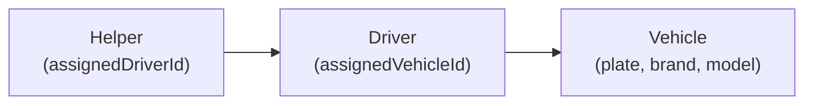

# Design Document: Helper Management Redesign

## Overview

The Helper Management Redesign transforms the existing helper list (`/helpers`) and detail (`/helpers/[id]`) pages into fully-featured personnel management screens matching the quality and patterns of the existing Driver Management pages. The redesign introduces performance metrics (rating, on-time percentage, trip count), a comprehensive tabbed detail view (Trip History, Payroll Summary, Payroll Settings, Active Trip), full CRUD via a side-sheet component, inline status changes, delete confirmations, POD history visibility, and consistent responsive design.

### Key Design Decisions

1. **Follow existing Driver Management patterns exactly** — The helper pages mirror the driver pages in structure, component usage, class names, and state management approach to maintain codebase consistency.
2. **Client-side rendering with "use client"** — Both pages are interactive dashboards requiring Zustand store access and local UI state.
3. **No new dependencies** — Uses existing shadcn/ui, Zustand, react-hook-form, zod, lucide-react, and sonner (toast). No additional packages.
4. **Vehicle resolution through driver** — Helpers don't directly own vehicles; the vehicle is resolved via `helper.assignedDriverId → driver.assignedVehicleId → vehicle`.
5. **Helper type extension with backward compatibility** — New `rating`, `onTimePercent`, and `totalTrips` fields default gracefully for existing records.
6. **Shared component patterns** — `StatCard` and `InfoRow` are local helper components within the detail page (matching driver page), while `PageHeader`, `KpiCard`, and form infrastructure are shared.

---

## Architecture

### Component Tree

```mermaid
graph TD
    HLP["app/(app)/helpers/page.tsx"]
    HLP --> PH1["PageHeader (existing)"]
    HLP --> KPI["KPI_Panel (4x KpiCard)"]
    HLP --> FT["Filter Toolbar (search + status)"]
    HLP --> DT["Data Table"]
    HLP --> RC["Result Count Footer"]
    HLP --> AHS["AddHelperSheet"]
    HLP --> DD["Delete Confirmation Dialog"]

    HDP["app/(app)/helpers/[id]/page.tsx"]
    HDP --> PH2["PageHeader (existing)"]
    HDP --> SR["Stat Row (4x StatCard)"]
    HDP --> PHero["Profile Hero Card"]
    HDP --> PerfVeh["Performance + Vehicle Grid"]
    PerfVeh --> PC["Performance_Card"]
    PerfVeh --> VC["Vehicle_Card"]
    HDP --> Tabs["Tabs Component"]
    Tabs --> TH["Trip History Tab"]
    Tabs --> PS["Payroll Summary Tab"]
    Tabs --> PSt["Payroll Settings Tab"]
    Tabs --> AT["Active Trip Tab"]
    HDP --> AHS2["AddHelperSheet (edit mode)"]
    HDP --> DD2["Delete Confirmation Dialog"]
```



### Data Flow

```mermaid
flowchart LR
    subgraph Zustand Stores
        HS[useHelperStore]
        DS[useDriverStore]
        FS[useFleetStore]
        TS[useTripStore]
        PPS[usePayrollPeriodStore]
        DPPS[useDriverPayrollProfileStore]
    end

    subgraph Helper List Page State
        Search[search: string]
        Status[statusFilter: string]
        SheetState[sheetOpen + editingHelper]
        DeleteState[deleteTarget: Helper | null]
    end

    subgraph Helper Detail Page State
        EditOpen[editOpen: boolean]
        DeleteOpen[deleteOpen: boolean]
    end

    HS -->|helpers| HLP
    DS -->|drivers| HLP
    FS -->|vehicles| HLP
    TS -->|trips| HLP

    HS -->|helper| HDP
    DS -->|drivers| HDP
    FS -->|vehicles| HDP
    TS -->|trips| HDP
    PPS -->|periods, summaries| HDP
    DPPS -->|profiles| HDP
```

### Vehicle Resolution Chain



For any helper, the assigned vehicle is resolved by:
1. Look up `helper.assignedDriverId` in `useDriverStore`
2. If driver found, look up `driver.assignedVehicleId` in `useFleetStore`
3. If vehicle found, display plate; otherwise show appropriate empty state

### State Management Strategy

| State | Location | Rationale |
|-------|----------|-----------|
| Helper records | `useHelperStore` (Zustand, persisted) | Global shared data |
| Driver records | `useDriverStore` (Zustand, persisted) | Resolution reference |
| Vehicle records | `useFleetStore` (Zustand, persisted) | Resolution reference |
| Trip records | `useTripStore` (Zustand, persisted) | Trip history + metrics |
| Payroll periods/summaries | `usePayrollPeriodStore` (Zustand, persisted) | Payroll tab data |
| Payroll profiles | `useDriverPayrollProfileStore` (Zustand, persisted) | Payroll settings |
| Search text | `useState` local (list page) | Ephemeral, page-only |
| Status filter | `useState` local (list page) | Ephemeral, page-only |
| Sheet open/edit state | `useState` local | Page-only UI state |
| Delete dialog target | `useState` local | Page-only UI state |
| Edit open (detail) | `useState` local | Page-only UI state |
| Delete open (detail) | `useState` local | Page-only UI state |

---

## Components and Interfaces

### Type Extension: `lib/types.ts`

```typescript
export interface Helper {
  id: string;
  name: string;
  phone: string;
  email?: string;
  status: "active" | "off_duty" | "on_leave";
  assignedDriverId?: string;
  hireDate?: string;
  address?: string;
  emergencyContact?: string;
  photoUrl?: string;
  employmentType?: EmploymentType;
  monthlyBaseSalary?: number;
  baseRatePerTrip?: number;
  ratePerKm?: number;
  commissionPercent?: number;
  notes?: string;
  createdAt: string;
  // NEW performance fields
  rating?: number;          // 0–5, default 0
  onTimePercent?: number;   // 0–100, default 100
  totalTrips?: number;      // >= 0, default 0
}
```

**Backward Compatibility:** Components read these fields with fallback defaults:
```typescript
const rating = helper.rating ?? 0;
const onTimePercent = helper.onTimePercent ?? 100;
const totalTrips = helper.totalTrips ?? 0;
```

### Helper List Page: `app/(app)/helpers/page.tsx`

Root "use client" component orchestrating the full list view.

```typescript
// Key local state
interface HelpersPageState {
  search: string;
  statusFilter: string; // "all" | "active" | "off_duty" | "on_leave"
  sheetOpen: boolean;
  editingHelper: Helper | null;
  deleteTarget: Helper | null;
}
```

**Computed values:**
- `filtered`: helpers matching search (name/phone, case-insensitive) AND status filter
- `counts`: { total, active, off_duty, on_leave } derived from full helpers array
- `tripCountByHelper`: Record<string, number> from trips grouped by helperId

### AddHelperSheet: `components/forms/AddHelperSheet.tsx`

```typescript
interface AddHelperSheetProps {
  open: boolean;
  onOpenChange: (v: boolean) => void;
  editHelper?: Helper | null;
}
```

**Form schema (zod):**
```typescript
const helperSchema = z.object({
  name: z.string().min(1, "Name is required").max(100),
  phone: z.string().min(1, "Phone is required"),
  email: z.string().email().optional().or(z.literal("")),
  address: z.string().optional(),
  emergencyContact: z.string().optional(),
  status: z.enum(["active", "off_duty", "on_leave"]),
  assignedDriverId: z.string().optional(),
  employmentType: z.enum(["per_trip", "monthly", "hybrid"]),
  monthlyBaseSalary: z.number().min(0).optional(),
  baseRatePerTrip: z.number().min(0).optional(),
  ratePerKm: z.number().min(0).optional(),
  commissionPercent: z.number().min(0).max(100).optional(),
  notes: z.string().max(500).optional(),
});
```

**Conditional fields:**
- `monthlyBaseSalary` shown when employmentType is "monthly" or "hybrid"
- `baseRatePerTrip` shown when employmentType is "per_trip" or "hybrid"

**Behavior:**
- Add mode: empty form, calls `addHelper` on submit
- Edit mode: pre-populated, calls `updateHelper` on submit
- Validation errors shown inline below each field
- Toast on success: "Helper {name} added" / "Helper {name} updated"

### Helper Detail Page: `app/(app)/helpers/[id]/page.tsx`

Root "use client" component for the detail view.

**Local helper components:**
```typescript
function StatCard({ label, value, icon, variant }: {
  label: string;
  value: string | number;
  icon: LucideIcon;
  variant?: string;
}) // Matches driver detail page pattern exactly

function InfoRow({ icon, label, value }: {
  icon: LucideIcon;
  label: string;
  value: string;
}) // Matches driver detail page pattern exactly
```

**Tabs structure:**
1. **Trip History** — Filtered trips table with POD column
2. **Payroll Summary** — Total earned + payroll period table
3. **Payroll Settings** — Rate cards + government deduction tiles
4. **Active Trip** — Current in-progress trip or empty state

### Utility Functions

```typescript
// Vehicle resolution helper (used in both list and detail)
function resolveHelperVehicle(
  helper: Helper,
  drivers: Driver[],
  vehicles: Vehicle[]
): { driver?: Driver; vehicle?: Vehicle }

// Trip count with fallback
function getHelperTripCount(
  helper: Helper,
  tripCountMap: Record<string, number>
): number
// Returns helper.totalTrips if > 0, else tripCountMap[helper.id] ?? 0

// KPI count computation
function computeHelperCounts(helpers: Helper[]): {
  total: number;
  active: number;
  off_duty: number;
  on_leave: number;
}

// Filter helpers with AND logic
function filterHelpers(
  helpers: Helper[],
  search: string,
  statusFilter: string
): Helper[]

// Trip history derivation
function getHelperTrips(
  trips: Trip[],
  helperId: string
): Trip[]
// Returns trips.filter(t => t.helperId === helperId), sorted by date descending

// Payroll total computation
function computeTotalEarned(summaries: PayrollSummary[]): number
// Returns sum of netPay for summaries with status === "paid"

// Active trip detection
function findActiveTrip(
  trips: Trip[],
  helperId: string
): Trip | undefined
// Returns first trip where helperId matches and status is active

// Progress bar width calculation
function computeProgressWidth(value: number, max: number): number
// Returns (value / max) * 100, clamped to 0–100
```

---

## Data Models

### Extended Helper Type (Changes to `lib/types.ts`)

Added fields with optional typing for backward compatibility:
- `rating?: number` — 0 to 5, displayed as X.X format
- `onTimePercent?: number` — 0 to 100, displayed with progress bar
- `totalTrips?: number` — non-negative integer

### Seed Data Update (`lib/data/helpers.ts`)

All seed helpers get realistic performance values:
```typescript
{ id: "h-001", ..., rating: 4.2, onTimePercent: 92, totalTrips: 47 }
{ id: "h-002", ..., rating: 3.8, onTimePercent: 88, totalTrips: 31 }
{ id: "h-003", ..., rating: 4.5, onTimePercent: 95, totalTrips: 22 }
{ id: "h-004", ..., rating: 3.2, onTimePercent: 78, totalTrips: 15 }
{ id: "h-005", ..., rating: 4.0, onTimePercent: 90, totalTrips: 8 }
```

### Trip Data Reference (Existing, No Changes)

```typescript
interface Trip {
  id: string;
  helperId?: string;          // links trip to helper
  helperName?: string;
  helperRate?: number;
  helperFee?: number;
  status: TripStatus;
  pickup: { address: string };
  dropoff: { address: string };
  fare: number;
  eta?: string;
  podSubmittedAt?: string;    // POD indicator
  approvalStatus?: TripApprovalStatus;
  // ... other fields
}
```

### Payroll Data Reference (Existing, No Changes)

```typescript
interface PayrollSummary {
  id: string;
  driverId: string;           // reused for helpers
  payrollPeriodId: string;
  payrollMode: PayrollMode;
  tripsCount: number;
  tripEarnings: number;
  incentives: number;
  totalDeductions: number;
  netPay: number;
  status: "draft" | "approved" | "paid";
}
```

---

## Correctness Properties

*A property is a characteristic or behavior that should hold true across all valid executions of a system — essentially, a formal statement about what the system should do. Properties serve as the bridge between human-readable specifications and machine-verifiable correctness guarantees.*

### Property 1: Backward compatibility defaults

*For any* Helper object that is missing the `rating`, `onTimePercent`, or `totalTrips` fields, the rendering logic SHALL produce default values of 0, 100, and 0 respectively, ensuring existing records display correctly without data migration.

**Validates: Requirements 1.4**

### Property 2: KPI status count computation

*For any* array of Helper objects, the computed count for each status ("active", "off_duty", "on_leave") SHALL equal the number of helpers whose `status` field matches that value, and the sum of all three counts SHALL equal the total helper count.

**Validates: Requirements 2.4**

### Property 3: Rating formatting

*For any* numeric rating value in the range [0, 5], the formatted display string SHALL contain exactly one decimal place (e.g., "4.0", "3.7", "0.0").

**Validates: Requirements 3.2**

### Property 4: Trip count source logic

*For any* Helper with `totalTrips > 0`, the displayed trip count SHALL equal `helper.totalTrips`. *For any* Helper with `totalTrips === 0` (or undefined), the displayed trip count SHALL equal the count of trips in the trip store where `trip.helperId === helper.id`.

**Validates: Requirements 3.4**

### Property 5: Vehicle resolution chain

*For any* Helper, Driver, and Vehicle configuration: if `helper.assignedDriverId` matches a driver AND that driver's `assignedVehicleId` matches a vehicle, the resolved plate SHALL equal that vehicle's `plate` field. If no driver is found, the result SHALL be undefined. If the driver has no vehicle, the result SHALL indicate "driver has no vehicle."

**Validates: Requirements 3.5, 12.2**

### Property 6: Combined filter logic

*For any* array of Helper objects, search string, and status filter value, the filtered result SHALL contain exactly those helpers satisfying ALL of: (a) the helper's name or phone contains the search string case-insensitively, AND (b) the helper's status matches the status filter (or all statuses if filter is "all"). The filtered count SHALL equal the length of this result set.

**Validates: Requirements 4.1, 4.4, 4.5**

### Property 7: Status change updates store

*For any* Helper and any target status different from the helper's current status, after a status change operation the helper's `status` field in the store SHALL equal the target status, and all other fields SHALL remain unchanged.

**Validates: Requirements 6.1, 6.2**

### Property 8: Delete removes helper

*For any* Helper in the store, after a confirmed delete operation, the store SHALL no longer contain a helper with that ID, and all other helpers SHALL remain unchanged with their original data.

**Validates: Requirements 7.3**

### Property 9: Form validation rejects empty required fields

*For any* form submission where the `name` field is empty or the `phone` field is empty, the validation function SHALL return at least one error, and the form SHALL NOT be submitted to the store.

**Validates: Requirements 8.5**

### Property 10: Progress bar width computation

*For any* numeric value and maximum (where max > 0), the computed progress bar width percentage SHALL equal `(value / max) * 100` clamped to the range [0, 100].

**Validates: Requirements 11.2, 11.3**

### Property 11: Trip count derivation (completed and delayed)

*For any* array of Trip objects filtered by a given helperId, the completed trip count SHALL equal the number of trips with status "completed" or "delivered", and the delayed trip count SHALL equal the number of trips with status "delayed".

**Validates: Requirements 11.4**

### Property 12: Trip history filtering and sorting

*For any* array of Trip objects and a given helperId, the trip history result SHALL contain exactly those trips where `trip.helperId === helperId`, sorted by date in descending order (newest first), such that each trip's date is >= the next trip's date in the sequence.

**Validates: Requirements 13.3, 13.4**

### Property 13: Total earned computation

*For any* array of PayrollSummary objects, the total earned value SHALL equal the sum of `netPay` for all summaries whose `status === "paid"`.

**Validates: Requirements 14.1**

### Property 14: Payroll summaries filtering and sorting

*For any* array of PayrollSummary objects, periods, and a given helperId, the filtered result SHALL contain exactly those summaries where `summary.driverId === helperId`, sorted by the associated period's `endDate` in descending order.

**Validates: Requirements 14.3**

### Property 15: Active trip selection

*For any* array of Trip objects and a given helperId, the active trip selection SHALL return the first trip (if any) where `trip.helperId === helperId` AND `trip.status` is one of "in_transit", "loaded", "vehicle_dispatched", or "driver_assigned".

**Validates: Requirements 16.1**

### Property 16: POD indicator logic

*For any* Trip object, the POD indicator SHALL display a document/check icon if and only if the trip has a truthy `podSubmittedAt` value; otherwise it SHALL display a dash "—".

**Validates: Requirements 20.1**

---

## Error Handling

### Store/Data Errors

| Scenario | Handling |
|----------|----------|
| Helper not found (detail page) | Display "Helper not found" message with Back button to /helpers |
| Helper_Store empty | KPI shows 0 values; table shows empty state with "Add Helper" button |
| Driver_Store has no matching driver | Vehicle column shows "—"; Vehicle_Card shows "No vehicle assigned" |
| Driver found but no vehicle assigned | Vehicle column shows "—"; Vehicle_Card shows "Driver has no vehicle assigned" |
| Trip_Store empty for helper | Trip History shows empty state; Active Trip shows empty state |
| Payroll summaries empty | Payroll Summary shows empty state with Wallet icon |
| No payroll profile exists | Payroll Settings shows empty state with link to Payroll module |

### Form Validation Errors

| Field | Validation | Error Message |
|-------|-----------|---------------|
| Name | Required, max 100 chars | "Name is required" |
| Phone | Required | "Phone is required" |
| Email | Optional, valid email format | "Valid email required" |
| Monthly Salary | Non-negative number | "Must be a positive number" |
| Per Trip Rate | Non-negative number | "Must be a positive number" |
| Rate per KM | Non-negative number | "Must be a positive number" |
| Commission % | 0–100 | "Must be between 0 and 100" |
| Notes | Max 500 characters | "Maximum 500 characters" |

- Inline errors appear below each invalid field with `text-status-danger` styling
- Submit button remains clickable but triggers validation on press
- Sheet does NOT close on validation failure

### Edge Cases

| Edge Case | Behavior |
|-----------|----------|
| Helper with all optional fields empty | Profile hero shows "—" for empty fields |
| Helper with rating exactly 0 | Star displays "0.0" (not hidden) |
| Helper with onTimePercent of 0% | Progress bar shows empty (0 width) |
| Very long helper name (100 chars) | Truncated with ellipsis in table cells; full in sheet/detail |
| Trips with both helperRate and helperFee | Prefer `helperRate`; fallback to `helperFee` |
| Multiple "active" trips for same helper | Display the first matching trip found |
| Delete last helper in store | Table shows zero-state empty message |

---

## Testing Strategy

### Property-Based Testing

**Library:** [fast-check](https://github.com/dubzzz/fast-check) — compatible with the project's test setup.

**Configuration:** Minimum 100 iterations per property test.

**Tag format:** `Feature: helper-management-redesign, Property {N}: {property title}`

The following pure utility/logic functions SHALL be tested with property-based tests:

1. **Backward compatibility defaults** (`applyHelperDefaults`) — Property 1
2. **KPI count computation** (`computeHelperCounts`) — Property 2
3. **Rating formatting** (`formatRating`) — Property 3
4. **Trip count source logic** (`getHelperTripCount`) — Property 4
5. **Vehicle resolution** (`resolveHelperVehicle`) — Property 5
6. **Combined filter logic** (`filterHelpers`) — Property 6
7. **Status change** (`updateHelper` with status patch) — Property 7
8. **Delete operation** (`deleteHelper`) — Property 8
9. **Form validation** (`helperSchema.safeParse`) — Property 9
10. **Progress bar width** (`computeProgressWidth`) — Property 10
11. **Trip count derivation** (completed/delayed counts) — Property 11
12. **Trip history filter + sort** (`getHelperTrips`) — Property 12
13. **Total earned computation** (`computeTotalEarned`) — Property 13
14. **Payroll summaries filter + sort** — Property 14
15. **Active trip selection** (`findActiveTrip`) — Property 15
16. **POD indicator logic** — Property 16

### Unit Tests (Example-Based)

- Component rendering: PageHeader, KpiCard panel, table columns, stat row
- AddHelperSheet opens in add vs edit mode with correct headings
- Delete confirmation dialog shows correct helper name
- Toast notifications fire with correct messages
- Empty states render correctly (zero helpers, zero trips, zero payroll)
- Tab switching renders correct content
- Navigation: View Profile links to correct URL, payroll row links to correct URL
- Responsive classes applied (grid-cols-2 vs grid-cols-4)

### Integration Tests

- Full list page render with seeded data → verify table rows match helper count
- Add helper via sheet → verify new row appears in table
- Edit helper via sheet → verify updated data in table
- Delete helper → verify row removed
- Status change via dropdown → verify badge updates
- Search filter → verify correct rows displayed
- Detail page tabs → verify data in each tab matches helper's records
- Vehicle resolution end-to-end (helper → driver → vehicle plate)

