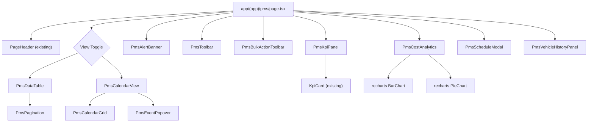

# Design Document: PMS Page Redesign

## Overview

The PMS (Preventive Maintenance Schedule) page redesign transforms the existing basic table-based maintenance view into a premium, modern SaaS dashboard. The redesign introduces enhanced analytics with KPI trends, a multi-view data interface (table + calendar), bulk operations, vehicle service history, cost analytics, export capabilities, and full accessibility compliance — all while leveraging the existing NexLogistics design system (shadcn/ui, Tailwind brand tokens, Zustand stores).

### Key Design Decisions

1. **Client-side rendering with "use client"** — Consistent with the existing page and all interactive dashboard pages in the app.
2. **Local UI state via useState/useReducer** — PMS-page-only state (filters, selections, view mode, modal state) stays local per Requirement 14.5; global data remains in Zustand stores.
3. **No new dependencies** — Uses existing recharts, shadcn/ui, framer-motion, and lucide-react. Calendar built with shadcn/ui Calendar component (added if needed) and custom grid.
4. **Component-per-concern architecture** — Each feature area gets its own file in `components/pms/`, enabling reuse and isolation.
5. **Progressive disclosure** — KPI summary → Alert → Toolbar → Data view. Complex interactions (history, analytics) are in drawers/collapsible panels to keep the primary view clean.

---

## Architecture

### Component Tree



### Data Flow

```mermaid
flowchart LR
    subgraph Zustand Stores
        MS[useMaintenanceStore]
        FS[useFleetStore]
        UI[useUiStore]
    end

    subgraph PMS Page Local State
        Filters[filters: search, status, dateRange]
        Selection[selectedIds: Set]
        ViewMode[viewMode: table | calendar]
        ModalState[modalOpen, editingRecord]
        HistoryPanel[vehicleHistoryId]
        Dismissed[alertDismissed]
    end

    MS -->|records| PmsPage
    FS -->|vehicles| PmsPage
    UI -->|darkMode| PmsPage

    PmsPage --> Filters
    PmsPage --> Selection
    PmsPage --> ViewMode

    Filters -->|filtered records| TableView
    Filters -->|filtered records| CalendarView
    Selection -->|selected rows| BulkActionBar
    ModalState -->|open/close| ScheduleModal
    HistoryPanel -->|vehicleId| VehicleHistory
```

### State Management Strategy

| State | Location | Rationale |
|-------|----------|-----------|
| Maintenance records | `useMaintenanceStore` (Zustand, persisted) | Global, shared data |
| Vehicle data | `useFleetStore` (Zustand, persisted) | Global reference data |
| Dark mode | `useUiStore` (Zustand, persisted) | App-wide preference |
| Search text | `useState` local | Page-only, ephemeral |
| Status filter | `useState` local | Page-only |
| Date range filter | `useState` local | Page-only |
| Selected row IDs | `useState<Set<string>>` local | Page-only |
| View mode (table/calendar) | `useState` local | Page-only |
| Sort column & direction | `useState` local | Page-only |
| Page size & current page | `useState` local | Page-only |
| Modal open + editing record | `useState` local | Page-only |
| Vehicle history panel ID | `useState` local | Page-only |
| Alert dismissed | `sessionStorage` + `useState` | Per-session, persists across navigation |
| Cost analytics collapsed | `sessionStorage` + `useState` | Per-session preference |

---

## Components and Interfaces

### Page Component: `app/(app)/pms/page.tsx`

The root "use client" component that orchestrates all sub-components and holds local state.

```typescript
// Key local state shape
interface PmsPageState {
  search: string;
  statusFilter: MaintenanceStatus[];
  dateRange: { start?: string; end?: string };
  viewMode: "table" | "calendar";
  sortColumn: string;
  sortDirection: "asc" | "desc";
  pageSize: 10 | 25 | 50;
  currentPage: number;
  selectedIds: Set<string>;
  modalState: { open: boolean; mode: "add" | "edit"; record?: MaintenanceRecord };
  vehicleHistoryId: string | null;
  alertDismissed: boolean;
  costAnalyticsCollapsed: boolean;
}
```

### `components/pms/PmsKpiPanel.tsx`

Renders 5 KPI cards (Overdue, Due Soon, Upcoming, Completed, Monthly Cost) using the existing `KpiCard` component.

```typescript
interface PmsKpiPanelProps {
  records: MaintenanceRecord[];
}
```

- Computes status counts from records
- Computes 8-week sparkline data per status
- Computes current month cost total
- Applies pulsing animation to Overdue card when count > 0
- Responsive: 2-col on mobile, 5-col on md+

### `components/pms/PmsAlertBanner.tsx`

Danger alert for overdue items with dismiss/reappear logic.

```typescript
interface PmsAlertBannerProps {
  overdueRecords: MaintenanceRecord[];
  vehicles: Vehicle[];
  dismissed: boolean;
  onDismiss: () => void;
  onViewAll: () => void;
}
```

- Renders only when overdue count > 0 and not dismissed
- Uses `role="alert"` and `aria-live="polite"`
- Shows most-overdue item (earliest dueDate)
- "View All Overdue" button triggers filter + scroll

### `components/pms/PmsToolbar.tsx`

Filter controls, search, view toggle, and export dropdown.

```typescript
interface PmsToolbarProps {
  search: string;
  onSearchChange: (value: string) => void;
  statusFilter: MaintenanceStatus[];
  onStatusFilterChange: (statuses: MaintenanceStatus[]) => void;
  dateRange: { start?: string; end?: string };
  onDateRangeChange: (range: { start?: string; end?: string }) => void;
  viewMode: "table" | "calendar";
  onViewModeChange: (mode: "table" | "calendar") => void;
  onExport: (format: "csv" | "pdf") => void;
  filteredCount: number;
}
```

### `components/pms/PmsBulkActionToolbar.tsx`

Contextual toolbar that appears above the table when rows are selected.

```typescript
interface PmsBulkActionToolbarProps {
  selectedCount: number;
  onMarkComplete: () => void;
  onDelete: () => void;
  onExportSelected: () => void;
  onClearSelection: () => void;
}
```

- Uses `aria-live="polite"` to announce selection count changes
- Confirmation dialog for destructive delete action

### `components/pms/PmsDataTable.tsx`

Enhanced data table with sorting, pagination, checkboxes, and responsive card layout on mobile.

```typescript
interface PmsDataTableProps {
  records: MaintenanceRecord[];
  vehicles: Vehicle[];
  sortColumn: string;
  sortDirection: "asc" | "desc";
  onSort: (column: string) => void;
  selectedIds: Set<string>;
  onSelectionChange: (ids: Set<string>) => void;
  pageSize: number;
  currentPage: number;
  onPageChange: (page: number) => void;
  onPageSizeChange: (size: 10 | 25 | 50) => void;
  onEditRecord: (record: MaintenanceRecord) => void;
  onDeleteRecord: (id: string) => void;
  onVehicleClick: (vehicleId: string) => void;
}
```

- Semantic HTML: `<table>`, `<thead>`, `<th scope="col">`, `<td>`
- Below 768px transforms to card-based list layout
- Empty state with "Clear Filters" action
- Color-coded status badges

### `components/pms/PmsCalendarView.tsx`

Monthly calendar grid showing maintenance events.

```typescript
interface PmsCalendarViewProps {
  records: MaintenanceRecord[];
  vehicles: Vehicle[];
  onEventClick: (record: MaintenanceRecord) => void;
}
```

- ARIA `grid`/`gridcell` roles with accessible labels
- Color-coded events by status
- "+N more" overflow popover for cells with > 3 events
- Month navigation with today highlighting (brand teal)

### `components/pms/PmsScheduleModal.tsx`

Slide-over drawer (Sheet) for add/edit maintenance schedules.

```typescript
interface PmsScheduleModalProps {
  open: boolean;
  mode: "add" | "edit";
  record?: MaintenanceRecord;
  vehicles: Vehicle[];
  onSubmit: (data: Omit<MaintenanceRecord, "id">) => void;
  onClose: () => void;
}
```

- Full-screen on mobile (<768px)
- Inline validation with `aria-describedby` and `aria-invalid`
- Focus trap via shadcn/ui Sheet
- Submit disabled until form is dirty
- Suggestion list for Service Type

### `components/pms/PmsVehicleHistoryPanel.tsx`

Slide-over drawer showing a vehicle's complete maintenance history.

```typescript
interface PmsVehicleHistoryPanelProps {
  vehicleId: string;
  records: MaintenanceRecord[];
  vehicle: Vehicle;
  open: boolean;
  onClose: () => void;
}
```

- Reverse chronological record list
- Summary header: plate, lifetime cost, completed count
- Mini timeline: 12-month service frequency visualization
- Paginated at 50 records

### `components/pms/PmsCostAnalytics.tsx`

Collapsible section with cost charts using recharts.

```typescript
interface PmsCostAnalyticsProps {
  records: MaintenanceRecord[];
  collapsed: boolean;
  onToggleCollapse: () => void;
}
```

- Monthly bar chart (6 months)
- Service type breakdown pie/bar chart
- Month-over-month comparison with directional indicator
- Empty state when no cost data

### `lib/services/pms-export.ts`

Export utility (non-component) for CSV and PDF generation.

```typescript
interface ExportOptions {
  records: MaintenanceRecord[];
  vehicles: Vehicle[];
  format: "csv" | "pdf";
}

function exportPmsReport(options: ExportOptions): Promise<void>;
```

- CSV: comma-separated with proper escaping
- PDF: uses browser print or jsPDF-like approach (no new deps — uses existing canvas/blob APIs)
- File naming: `pms-report-{YYYY-MM-DD}.{ext}`

---

## Data Models

### Existing Types (No Changes)

```typescript
// From lib/types.ts
type MaintenanceStatus = "upcoming" | "due_soon" | "overdue" | "completed";

interface MaintenanceRecord {
  id: string;
  vehicleId: string;
  type: string;
  dueDate: string;
  dueOdometer?: number;
  cost?: number;
  status: MaintenanceStatus;
  completedAt?: string;
  notes?: string;
}

type VehicleStatus = "available" | "in_trip" | "maintenance" | "inactive";

interface Vehicle {
  id: string;
  plate: string;
  type: string;
  brand: string;
  model: string;
  year: number;
  odometer: number;
  status: VehicleStatus;
  // ... other fields
}
```

### Derived Types (New, page-local)

```typescript
// Filter state shape
interface PmsFilters {
  search: string;
  statuses: MaintenanceStatus[];  // empty = all
  dateRange: { start?: string; end?: string };
}

// Sort state
interface PmsSort {
  column: "plate" | "type" | "dueDate" | "dueOdometer" | "cost" | "status";
  direction: "asc" | "desc";
}

// Calendar event (derived for calendar view)
interface CalendarEvent {
  record: MaintenanceRecord;
  vehiclePlate: string;
  date: string; // ISO date (YYYY-MM-DD)
  label: string; // "{plate} - {type}"
  statusColor: string;
}

// KPI Sparkline data point
interface WeeklyCount {
  week: string; // ISO week identifier
  count: number;
}

// Cost analytics data point
interface MonthlyCost {
  month: string; // YYYY-MM
  label: string; // "Jan", "Feb", etc.
  total: number;
}

// Service type cost breakdown
interface ServiceTypeCost {
  type: string;
  total: number;
  percentage: number;
}

// Form validation schema for Schedule Modal
interface ScheduleFormData {
  vehicleId: string;       // required
  type: string;            // required, max 100 chars
  dueDate: string;         // required, today or future
  dueOdometer?: number;    // optional, 0–9,999,999
  cost?: number;           // optional, 0.01–99,999,999.99
  notes?: string;          // optional, max 500 chars
}

interface ScheduleFormErrors {
  vehicleId?: string;
  type?: string;
  dueDate?: string;
  dueOdometer?: string;
  cost?: string;
  notes?: string;
}
```

### Store Extensions

The existing `useMaintenanceStore` interface already provides:
- `records: MaintenanceRecord[]`
- `addRecord(r: Omit<MaintenanceRecord, "id">): MaintenanceRecord`
- `updateRecord(id: string, patch: Partial<MaintenanceRecord>): void`
- `deleteRecord(id: string): void`

No store modifications are needed. Bulk delete uses `deleteRecord` in a loop. Bulk complete uses `updateRecord` in a loop.

---


## Correctness Properties

*A property is a characteristic or behavior that should hold true across all valid executions of a system — essentially, a formal statement about what the system should do. Properties serve as the bridge between human-readable specifications and machine-verifiable correctness guarantees.*

### Property 1: Status count computation

*For any* array of MaintenanceRecord objects, the computed count for each status ("overdue", "due_soon", "upcoming", "completed") SHALL equal the number of records in the array whose `status` field matches that value, and the sum of all four counts SHALL equal the total record count.

**Validates: Requirements 2.2, 2.9**

### Property 2: Sparkline weekly bucketing

*For any* array of MaintenanceRecord objects with valid `dueDate` values spanning up to 8 calendar weeks, the sparkline data computation SHALL produce one data point per distinct calendar week, each point's value equaling the count of records whose `dueDate` falls within that ISO week, and the sum of all data points SHALL equal the count of input records within the 8-week window.

**Validates: Requirements 2.3, 2.4**

### Property 3: Monthly cost aggregation

*For any* array of MaintenanceRecord objects, the monthly cost computation for a given month SHALL equal the sum of the `cost` field (treating undefined/null as 0) of all records whose `completedAt` or `dueDate` falls within that calendar month, and computing over 6 consecutive months SHALL produce exactly 6 data points whose values are all ≥ 0.

**Validates: Requirements 2.5, 9.1**

### Property 4: Currency formatting round-trip

*For any* non-negative number, the `formatCurrency` function SHALL produce a string that starts with "₱", uses the en-PH locale grouping (commas for thousands), contains exactly two decimal digits, and when the numeric characters are parsed back to a number, the result SHALL equal the input rounded to 2 decimal places.

**Validates: Requirements 2.6, 9.5**

### Property 5: Sorting produces correct order

*For any* array of MaintenanceRecord objects and any sortable column (plate, type, dueDate, dueOdometer, cost, status), sorting in ascending order SHALL produce a sequence where each element's sort key is ≤ the next element's sort key, and sorting in descending order SHALL produce the reverse relationship (≥). The sorted array SHALL contain exactly the same elements as the input.

**Validates: Requirements 3.2, 6.2, 3.10**

### Property 6: Pagination boundaries

*For any* array of N records and any valid page size P (10, 25, or 50), the total page count SHALL equal ⌈N/P⌉, each page (except possibly the last) SHALL contain exactly P records, the last page SHALL contain N mod P records (or P if N mod P = 0), and the union of all pages SHALL equal the original array with no duplicates or omissions.

**Validates: Requirements 3.3**

### Property 7: Combined filter AND logic

*For any* combination of search text, status filter (subset of statuses), and date range (start/end), the filtered result SHALL contain exactly those records that satisfy ALL of: (a) the record's vehicle plate or service type contains the search text case-insensitively, (b) the record's status is in the selected status set (or all statuses if set is empty), and (c) the record's dueDate falls within the date range bounds. No record outside this intersection SHALL appear in results.

**Validates: Requirements 3.4, 3.5, 3.6, 3.7**

### Property 8: Select-all toggles current page only

*For any* paginated view with page size P showing page K, the select-all action SHALL add exactly the IDs of the P records on page K to the selection set without affecting selections from other pages, and deselect-all SHALL remove exactly those IDs.

**Validates: Requirements 4.1**

### Property 9: Bulk mark complete

*For any* non-empty subset of record IDs selected from the store, after the bulk "Mark Complete" action, every record in that subset SHALL have `status === "completed"` and a non-null `completedAt` timestamp, and all non-selected records SHALL remain unchanged.

**Validates: Requirements 4.3**

### Property 10: Bulk delete removes records

*For any* non-empty subset of record IDs selected from the store, after the bulk delete action is confirmed, the store SHALL contain none of the selected IDs, and all non-selected records SHALL remain unchanged with their original data.

**Validates: Requirements 4.4**

### Property 11: CSV export correctness

*For any* non-empty array of MaintenanceRecord objects and their resolved vehicle plates, the generated CSV output SHALL contain a header row with columns [Vehicle Plate, Service Type, Due Date, Due Odometer, Cost, Status, Completed At, Notes], followed by exactly N data rows (one per record), where each row's values match the corresponding record fields.

**Validates: Requirements 4.6, 10.2**

### Property 12: Form validation

*For any* ScheduleFormData object, the validation function SHALL return no errors when: vehicleId is non-empty, type is 1–100 characters, dueDate is today or a future date, dueOdometer (if provided) is 0–9,999,999, and cost (if provided) is 0.01–99,999,999.99. For any input violating these constraints, the function SHALL return an error message for each invalid field.

**Validates: Requirements 5.2, 5.6, 5.7**

### Property 13: Form dirty detection

*For any* initial form state and current form state, the dirty detection function SHALL return `true` if and only if at least one field value in the current state differs from the corresponding value in the initial state.

**Validates: Requirements 5.9**

### Property 14: Vehicle lifetime cost and completed count

*For any* array of MaintenanceRecord objects belonging to a single vehicle, the lifetime cost SHALL equal the sum of all `cost` fields (treating undefined as 0), and the completed count SHALL equal the number of records with `status === "completed"`.

**Validates: Requirements 6.3**

### Property 15: View toggle preserves filters

*For any* filter state (search, statuses, dateRange) and current view mode, toggling the view mode SHALL not alter any filter value — the filter state before and after the toggle SHALL be deeply equal.

**Validates: Requirements 7.1**

### Property 16: Calendar event label formatting

*For any* MaintenanceRecord with a resolvable vehicleId, the generated calendar event label SHALL contain both the vehicle's plate number and the record's service type.

**Validates: Requirements 7.2**

### Property 17: Calendar overflow indicator

*For any* day cell containing N maintenance events where N > 3, the cell SHALL display exactly 3 visible events and one overflow indicator showing "+{N-3} more", where the displayed count equals N minus 3.

**Validates: Requirements 7.7**

### Property 18: Most-overdue item selection

*For any* non-empty array of MaintenanceRecord objects with `status === "overdue"`, the Alert_Banner SHALL display the record whose `dueDate` is the earliest (minimum) date value among all overdue records.

**Validates: Requirements 8.2**

### Property 19: Service type cost breakdown

*For any* array of MaintenanceRecord objects with `cost > 0`, the service type breakdown SHALL produce one entry per distinct `type` value, each entry's total equaling the sum of `cost` for records of that type, and the sum of all entry percentages SHALL equal 100% (within floating-point tolerance of ±0.1%).

**Validates: Requirements 9.2**

### Property 20: Month-over-month percentage comparison

*For any* two non-negative numbers representing current and previous month totals: if the previous month total is 0, the comparison SHALL return "N/A"; otherwise, the percentage change SHALL equal `((current - previous) / previous) * 100`, with a positive result indicating increase and negative indicating decrease.

**Validates: Requirements 9.3, 9.4**

### Property 21: Export file naming

*For any* date and format ("csv" or "pdf"), the generated filename SHALL match the pattern `pms-report-{YYYY-MM-DD}.{ext}` where YYYY-MM-DD is the ISO date string of the export date and ext matches the selected format.

**Validates: Requirements 10.4**

### Property 22: Vehicle ID resolution

*For any* MaintenanceRecord whose `vehicleId` matches a Vehicle in the Fleet_Store, the displayed plate number SHALL equal that Vehicle's `plate` field. For any record whose `vehicleId` does not match any Vehicle, the display SHALL show the raw vehicleId string.

**Validates: Requirements 13.1, 13.5**

### Property 23: Vehicle dropdown filtering and sorting

*For any* array of Vehicle objects, the Schedule_Modal dropdown SHALL contain exactly those vehicles whose status is "available", "in_trip", or "maintenance" (excluding "inactive"), and the list SHALL be sorted in ascending alphabetical order by `plate` field.

**Validates: Requirements 13.2**

---

## Error Handling

### Network/Store Errors

| Scenario | Handling |
|----------|----------|
| Maintenance_Store empty | KPI shows 0 values; Table shows empty state; Cost analytics shows "no data" |
| Fleet_Store vehicle not found | Display raw vehicleId with "unavailable" indicator badge |
| Export generation fails | Error toast for 5 seconds; no file download; preserve current state |
| Bulk action fails | Error toast; preserve selection state and record data unchanged |

### Form Validation Errors

- Inline error messages below each invalid field
- Fields marked with `aria-invalid="true"` and `aria-describedby` pointing to error text
- Submit button remains disabled until all required fields valid and form dirty
- No partial submissions — either all data is valid and submitted, or nothing changes

### Edge Cases

| Edge Case | Behavior |
|-----------|----------|
| 0 records in store | All components render empty/zero states gracefully |
| Vehicle with 0 history records | History panel shows empty state message |
| Day with > 3 calendar events | Show first 3 + overflow "+N more" popover |
| Previous month cost = ₱0 | Month-over-month shows "N/A" |
| Filter yields 0 results | Empty state illustration + "Clear Filters" button |
| Export with 0 filtered records | Info message, no file generated |
| Record with missing cost | Treated as ₱0 in aggregations |
| Very long service type (100 chars) | Truncated with ellipsis in table; full text in modal |

---

## Testing Strategy

### Property-Based Testing

**Library:** [fast-check](https://github.com/dubzzz/fast-check) (already compatible with the project's Jest/Vitest setup)

**Configuration:** Minimum 100 iterations per property test.

**Tag format:** `Feature: pms-page-redesign, Property {N}: {title}`

The following pure utility functions SHALL be tested with property-based tests:

1. **Filter logic** (`filterRecords`) — Properties 7
2. **Sort logic** (`sortRecords`) — Property 5
3. **Pagination logic** (`paginateRecords`) — Property 6
4. **Status count computation** (`computeStatusCounts`) — Property 1
5. **Weekly sparkline bucketing** (`computeWeeklySparkline`) — Property 2
6. **Monthly cost aggregation** (`computeMonthlyCosts`) — Property 3
7. **Currency formatting** (`formatCurrency`) — Property 4
8. **Form validation** (`validateScheduleForm`) — Property 12
9. **Dirty detection** (`isFormDirty`) — Property 13
10. **Vehicle lifetime stats** (`computeVehicleStats`) — Property 14
11. **Calendar event generation** (`generateCalendarEvents`) — Properties 16, 17
12. **Most-overdue selection** (`findMostOverdue`) — Property 18
13. **Service type breakdown** (`computeServiceTypeCosts`) — Property 19
14. **Month-over-month comparison** (`computeMonthOverMonth`) — Property 20
15. **CSV generation** (`generateCsv`) — Property 11
16. **File naming** (`generateExportFilename`) — Property 21
17. **Vehicle resolution** (`resolveVehicle`) — Property 22
18. **Vehicle dropdown filtering** (`filterDropdownVehicles`) — Property 23
19. **Bulk operations** (`bulkMarkComplete`, `bulkDelete`) — Properties 9, 10
20. **Select-all logic** (`toggleSelectAll`) — Property 8
21. **View toggle filter preservation** — Property 15

### Unit Tests (Example-Based)

- Component rendering tests (KPI panel renders 5 cards, table renders columns, etc.)
- Modal open/close behavior
- Dark mode class toggling
- Accessibility attributes (ARIA roles, labels)
- Responsive layout breakpoint behavior
- Toast notification triggers
- Keyboard navigation (Tab, Escape, Enter)

### Integration Tests

- Full page render with seeded store data
- Filter → Table → Export workflow end-to-end
- Add record → verify it appears in table
- Bulk select → Mark complete → verify statuses changed
- Calendar event click → edit modal opens

### Accessibility Tests

- axe-core automated audit for WCAG AA compliance
- Contrast ratio verification in both light and dark modes
- Focus management verification (trap in modal, return on close)
- Screen reader announcement verification (aria-live regions)
