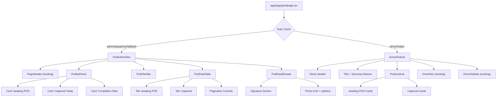

# Design Document: POD Page Redesign

## Overview

The Proof of Delivery (POD) page redesign transforms the existing basic card-list interface into a professional SaaS dashboard serving two distinct audiences: admin/dispatchers on desktop and drivers/helpers on mobile. The redesign introduces KPI metrics, an enhanced data table with tabs and filtering, a POD detail drawer for viewing captured evidence, and a refined mobile driver experience — all while maintaining full brand consistency with the NexLogistics design system.

### Key Design Decisions

1. **Client-side rendering with "use client"** — Consistent with the existing page and all interactive dashboard pages in the app.
2. **Local UI state via useState** — POD-page-only state (filters, active tab, drawer state, sidebar open) stays local; global data remains in Zustand stores (Requirement 10.5).
3. **No new dependencies** — Uses existing shadcn/ui, lucide-react, and Tailwind tokens (Requirement 10.6).
4. **Component-per-concern architecture** — Each feature area gets its own file in `components/pod/`, following the same pattern as `components/pms/` (Requirement 10.4).
5. **Role-based view routing at component level** — A single page component delegates rendering to either the Admin_View or Driver_View based on Auth_Store role, avoiding route-level splitting.
6. **Reactive Zustand subscriptions** — KPI counts and table data recompute automatically when Pod_Store or Trip_Store changes (Requirement 12.5).

---

## Architecture

### Component Tree



### Data Flow

```mermaid
flowchart LR
    subgraph Zustand Stores
        PS[usePodStore]
        TS[useTripStore]
        DS[useDriverStore]
        AS[useAuthStore]
        UIS[useUiStore]
    end

    subgraph POD Page Local State
        ActiveTab[activeTab: awaiting | captured]
        Search[search: string]
        DriverFilter[driverFilter: string | null]
        SortState[sortColumn + sortDirection]
        PageState[currentPage + pageSize]
        DrawerState[drawerOpen + selectedPod]
        SidebarState[sidebarOpen]
        LightboxState[lightboxOpen + lightboxIndex]
    end

    PS -->|pods| PodPage
    TS -->|trips filtered by status| PodPage
    DS -->|drivers for name resolution| PodPage
    AS -->|user role + driverId| PodPage
    UIS -->|darkMode, notifications| PodPage

    PodPage --> ActiveTab
    PodPage --> Search
    PodPage --> DriverFilter
    PodPage --> SortState
    PodPage --> PageState
    PodPage --> DrawerState

    Search -->|filtered records| DataTable
    DriverFilter -->|filtered records| DataTable
    SortState -->|sorted records| DataTable
    PageState -->|paginated records| DataTable
    DrawerState -->|selected POD| DetailDrawer
```

### State Management Strategy

| State | Location | Rationale |
|-------|----------|-----------|
| POD records | `usePodStore` (Zustand, persisted) | Global shared data |
| Trip data | `useTripStore` (Zustand, persisted) | Global shared data |
| Driver data | `useDriverStore` (Zustand, persisted) | Global reference data |
| User/role | `useAuthStore` (Zustand, persisted) | Global auth context |
| Dark mode | `useUiStore` (Zustand, persisted) | App-wide preference |
| Notifications | `useUiStore` (Zustand, persisted) | App-wide notifications |
| Active tab | `useState` local | Page-only, ephemeral |
| Search text | `useState` local | Page-only, ephemeral |
| Driver filter | `useState` local | Page-only, ephemeral |
| Sort column & direction | `useState` local | Page-only |
| Current page & page size | `useState` local | Page-only |
| Drawer open + selected POD | `useState` local | Page-only |
| Lightbox state | `useState` local | Page-only |
| Sidebar open (driver view) | `useState` local | Page-only |

---

## Components and Interfaces

### Page Component: `app/(app)/pod/page.tsx`

The root "use client" component that performs role-based routing and holds shared local state for the Admin view.

```typescript
// Key local state shape (Admin View)
interface PodPageAdminState {
  activeTab: "awaiting" | "captured";
  search: string;
  driverFilter: string | null;
  sortColumn: string;
  sortDirection: "asc" | "desc";
  currentPage: number;
  pageSize: number; // default 10
  drawerOpen: boolean;
  selectedPodId: string | null;
}
```

### `components/pod/PodAdminView.tsx`

Orchestrates the full Admin_View layout: PageHeader → KpiPanel → FilterBar → DataTable → DetailDrawer.

```typescript
interface PodAdminViewProps {
  trips: Trip[];
  pods: ProofOfDelivery[];
  drivers: Driver[];
}
```

### `components/pod/PodKpiPanel.tsx`

Renders 3 KPI cards: Awaiting POD, Captured Today, Completion Rate.

```typescript
interface PodKpiPanelProps {
  awaitingCount: number;
  capturedTodayCount: number;
  completionRate: number | null; // null = "N/A" (no delivered/completed trips)
}
```

- Uses shadcn/ui Card with brand shadow and rounded-lg
- Status-warning (#F59E0B) icon accent for Awaiting POD
- Status-success (#10B981) icon accent for Captured Today
- Brand-teal (#66B2B2) icon accent for Completion Rate
- Responsive: 3-col grid on md+, horizontal scroll with snap on mobile
- Locale-formatted numbers with thousands separators

### `components/pod/PodFilterBar.tsx`

Contains search input, driver dropdown filter, and is placed between KPI and table.

```typescript
interface PodFilterBarProps {
  search: string;
  onSearchChange: (value: string) => void;
  driverFilter: string | null;
  onDriverFilterChange: (driverId: string | null) => void;
  drivers: Driver[];
  resultCount: number;
}
```

- Search input with max 100 characters, debounced at 300ms
- Driver dropdown using shadcn/ui Select component
- aria-live region for result count announcements
- Responsive: stacks vertically below 768px

### `components/pod/PodDataTable.tsx`

Enhanced data table with Tabs (Awaiting / Captured), sorting, and pagination.

```typescript
interface PodDataTableProps {
  activeTab: "awaiting" | "captured";
  onTabChange: (tab: "awaiting" | "captured") => void;
  awaitingRecords: AwaitingPodRow[];
  capturedRecords: CapturedPodRow[];
  sortColumn: string;
  sortDirection: "asc" | "desc";
  onSort: (column: string) => void;
  currentPage: number;
  pageSize: number;
  onPageChange: (page: number) => void;
  onViewPod: (podId: string) => void;
}

interface AwaitingPodRow {
  tripId: string;
  driverName: string;
  pickupAddress: string;
  dropoffAddress: string;
  deliveryDate: string; // ISO timestamp
}

interface CapturedPodRow {
  tripId: string;
  podId: string;
  driverName: string;
  receiverName: string;
  captureDate: string; // ISO timestamp
  hasSignature: boolean;
  photoCount: number;
}
```

- Semantic HTML table (table, thead, tbody, th with scope="col")
- aria-sort on active sorted column header
- Truncation at 40 chars for addresses
- Color-coded Badge (amber for awaiting, emerald for captured)
- Paginated at 10 rows per page with prev/next controls
- Transforms to card layout below 768px
- Empty state with ClipboardCheck icon

### `components/pod/PodDetailDrawer.tsx`

Slide-over drawer for viewing captured POD details.

```typescript
interface PodDetailDrawerProps {
  open: boolean;
  pod: ProofOfDelivery | null;
  tripId: string | null;
  onClose: () => void;
}
```

- Uses shadcn/ui Sheet component (side="right")
- 480px width on md+, full-screen on mobile
- Displays: Trip ID, Receiver Name, Contact, Timestamp, GPS, Notes
- Signature image with bordered container and label
- Photo grid (2 columns) with lightbox on click
- Fallback placeholders for missing signature/photos
- Image error fallback: "Image failed to load"
- Focus trap and Escape key handling
- aria-labelledby, role="dialog", aria-modal="true"
- Returns focus to triggering button on close

### `components/pod/DriverPodList.tsx`

Mobile-optimized driver view (refactored from existing inline component).

```typescript
interface DriverPodListProps {
  user: User;
  trips: Trip[];
  pods: ProofOfDelivery[];
  drivers: Driver[];
}
```

- Full 100dvh layout with overscroll-none
- Sticky brand-navy header with hamburger, brand mark, bell icon
- Title banner with FileImage icon and Summary_Banner pills
- Scrollable content area with card lists
- Integrates DriverNav (active="pod") and DriverSidebar
- Filters trips to current driver's assignments
- 44x44px minimum touch targets
- Max-width 448px container centered

### `components/pod/PodCardList.tsx`

Card-based list component for the driver view showing awaiting and captured sections.

```typescript
interface PodCardListProps {
  awaitingTrips: Trip[];
  capturedTrips: Array<{ trip: Trip; pod: ProofOfDelivery }>;
  onCapture: (tripId: string) => void;
}
```

- Awaiting section: ordered by delivery date ascending (oldest first)
- Captured section: ordered by capture timestamp descending (most recent first)
- White cards with rounded-2xl, gray-100 border, shadow-sm
- Chevron icon on pending cards indicating tappable
- Empty states for both sections
- Accessible button/anchor elements with trip ID context

---

## Data Models

### Existing Types (No Changes)

```typescript
// From lib/types.ts
export type TripStatus =
  | "scheduled" | "driver_assigned" | "vehicle_dispatched"
  | "loaded" | "in_transit" | "delivered" | "delayed"
  | "completed" | "cancelled";

export interface Trip {
  id: string;
  clientId: string;
  driverId?: string;
  vehicleId?: string;
  pickup: { address: string; lat: number; lng: number; scheduledAt: string };
  dropoff: { address: string; lat: number; lng: number; scheduledAt: string };
  cargo: { type: string; weightKg: number; units: number; description?: string };
  distanceKm: number;
  fare: number;
  status: TripStatus;
  statusLogs: TripStatusLog[];
  podId?: string;
  createdAt: string;
  eta?: string;
  documentNo?: string;
  customerName?: string;
  customerContact?: string;
  notes?: string;
  helperId?: string;
  helperName?: string;
}

export interface ProofOfDelivery {
  id: string;
  tripId: string;
  receiverName: string;
  receiverContact?: string;
  signatureDataUrl?: string;
  photoDataUrls: string[];
  notes?: string;
  gps: { lat: number; lng: number };
  timestamp: string;
}

export interface Driver {
  id: string;
  name: string;
  email: string;
  phone: string;
  status: "active" | "off_duty" | "on_leave";
  // ... other fields
}

// From lib/store/auth.ts
export interface User {
  id: string;
  name: string;
  email: string;
  role: Role;
  driverId?: string;
  helperId?: string;
  clientId?: string;
}

export type Role = "super_admin" | "company_admin" | "dispatcher" | "driver" | "helper" | "accounting" | "client";
```

### Store Interfaces (No Changes)

```typescript
// usePodStore
interface PodState {
  pods: ProofOfDelivery[];
  addPod: (p: Omit<ProofOfDelivery, "id" | "timestamp">) => ProofOfDelivery;
  reset: () => void;
}

// useTripStore (relevant subset)
interface TripState {
  trips: Trip[];
  // ... other methods
}

// useDriverStore (relevant subset)
interface DriverState {
  drivers: Driver[];
  // ... other methods
}
```

### Derived Types (New, page-local)

```typescript
// Computed data for Admin KPIs
interface PodKpiData {
  awaitingCount: number;
  capturedTodayCount: number;
  completionRate: number | null; // null when no delivered/completed trips
}

// Row types for the data table
interface AwaitingPodRow {
  tripId: string;
  driverName: string; // "Unassigned" if unresolvable
  pickupAddress: string;
  dropoffAddress: string;
  deliveryDate: string; // ISO string from last statusLog or trip createdAt
}

interface CapturedPodRow {
  tripId: string;
  podId: string;
  driverName: string;
  receiverName: string;
  captureDate: string; // POD timestamp ISO string
  hasSignature: boolean;
  photoCount: number;
}

// Filter state
interface PodFilters {
  search: string;           // max 100 chars
  driverFilter: string | null; // driverId or null for all
}

// Sort state
interface PodSort {
  column: string;
  direction: "asc" | "desc";
}

// Pagination state
interface PodPagination {
  currentPage: number;
  pageSize: number; // default 10
}

// Driver view computed data
interface DriverPodSummary {
  pendingCount: number;
  capturedCount: number;
  awaitingTrips: Trip[];
  capturedItems: Array<{ trip: Trip; pod: ProofOfDelivery }>;
}
```

### Utility Functions (New, in `lib/utils/pod-helpers.ts`)

```typescript
// KPI computation
function computePodKpis(trips: Trip[], pods: ProofOfDelivery[]): PodKpiData;

// Table data derivation
function deriveAwaitingRows(trips: Trip[], pods: ProofOfDelivery[], drivers: Driver[]): AwaitingPodRow[];
function deriveCapturedRows(trips: Trip[], pods: ProofOfDelivery[], drivers: Driver[]): CapturedPodRow[];

// Filtering
function filterPodRows<T extends AwaitingPodRow | CapturedPodRow>(
  rows: T[],
  filters: PodFilters,
  tab: "awaiting" | "captured"
): T[];

// Sorting
function sortPodRows<T extends AwaitingPodRow | CapturedPodRow>(
  rows: T[],
  sort: PodSort
): T[];

// Pagination
function paginatePodRows<T>(rows: T[], pagination: PodPagination): {
  pageRows: T[];
  totalPages: number;
  totalCount: number;
};

// Driver view helpers
function computeDriverPodSummary(
  trips: Trip[],
  pods: ProofOfDelivery[],
  driverId: string | null
): DriverPodSummary;

// Driver name resolution
function resolveDriverName(driverId: string | undefined, drivers: Driver[]): string;

// Date formatting
function formatPodDate(isoString: string): string; // "MMM DD, YYYY HH:mm" en-PH
function formatDeliveryDate(isoString: string): string; // "MMM DD, YYYY" en-PH

// Number formatting
function formatCount(n: number): string; // locale thousands separators
```


---

## Correctness Properties

*A property is a characteristic or behavior that should hold true across all valid executions of a system — essentially, a formal statement about what the system should do. Properties serve as the bridge between human-readable specifications and machine-verifiable correctness guarantees.*

### Property 1: KPI computation correctness

*For any* array of Trip objects and any array of ProofOfDelivery objects:
- The "Awaiting POD" count SHALL equal the number of trips with status "delivered" or "completed" that have no matching POD record (by tripId) in the pods array.
- The "Captured Today" count SHALL equal the number of POD records whose timestamp falls within today's calendar day boundaries (local timezone).
- The "Completion Rate" SHALL equal `(pods matching delivered/completed trips / total delivered/completed trips) * 100`, rounded to the nearest integer and capped at 100; when zero delivered/completed trips exist, the rate SHALL be null.
- The sum of "Awaiting POD" count plus the count of delivered/completed trips that DO have a matching POD SHALL equal the total number of delivered/completed trips.

**Validates: Requirements 3.2, 3.3, 3.4, 3.5**

### Property 2: Count formatting round-trip

*For any* integer in the range [0, 99999], the `formatCount` function SHALL produce a string using locale-appropriate thousands separators, and when the non-separator numeric characters are parsed back to an integer, the result SHALL equal the original input.

**Validates: Requirements 3.9**

### Property 3: Admin table sorting produces correct order

*For any* array of AwaitingPodRow or CapturedPodRow objects and any sortable column, sorting in ascending order SHALL produce a sequence where each element's sort key is ≤ the next element's sort key (using locale-aware string comparison for text, chronological for dates), and sorting in descending order SHALL produce the reverse relationship (≥). The sorted array SHALL contain exactly the same elements as the input with no additions or omissions.

**Validates: Requirements 4.4, 4.5**

### Property 4: Combined filter logic (search + driver)

*For any* array of POD table rows, any search string (0–100 characters), and any driver filter (specific driverId or null for all): the filtered result SHALL contain exactly those rows where (a) the row's Trip ID, Driver Name, or Receiver Name (on captured tab) contains the search string case-insensitively (or all rows when search is empty), AND (b) the row's driverId matches the driver filter (or all rows when filter is null). No row outside this intersection SHALL appear in the results.

**Validates: Requirements 4.6, 4.7**

### Property 5: Pagination boundaries

*For any* array of N records and the page size of 10, the total page count SHALL equal ⌈N/10⌉, each page (except possibly the last) SHALL contain exactly 10 records, the last page SHALL contain N mod 10 records (or 10 if N mod 10 = 0), and the union of all pages SHALL equal the original array with no duplicates or omissions.

**Validates: Requirements 4.10**

### Property 6: Driver POD summary computation

*For any* array of trips, any array of POD records, and any driverId: the computed pending count SHALL equal the number of trips assigned to that driverId with status "delivered" or "completed" that have no matching POD, and the captured count SHALL equal the number of trips assigned to that driverId that DO have a matching POD. The sum of pending + captured SHALL equal the total delivered/completed trips for that driver.

**Validates: Requirements 6.3, 12.4**

### Property 7: Driver card ordering

*For any* array of awaiting trips for a driver, the cards SHALL be ordered by delivery date ascending (oldest first), such that each card's date is ≤ the next card's date. *For any* array of captured items for a driver, the cards SHALL be ordered by POD capture timestamp descending (most recent first), such that each card's timestamp is ≥ the next card's timestamp.

**Validates: Requirements 7.8**

### Property 8: Driver name resolution

*For any* driverId string and any array of Driver objects: if the driverId matches a driver in the array, the resolved name SHALL equal that driver's `name` field; if the driverId is undefined or does not match any driver, the resolved name SHALL equal "Unassigned".

**Validates: Requirements 12.3**

---

## Error Handling

### Data/Store Errors

| Scenario | Handling |
|----------|----------|
| Pod_Store empty (no pods) | KPI shows 0 captured, N/A or 0% rate; Captured tab shows empty state |
| Trip_Store has no delivered/completed trips | KPI shows 0 awaiting, N/A rate; Both tabs show empty state |
| Driver_Store driver not found for trip | Display "Unassigned" as driver name |
| Auth_Store returns null user | Fall back to Admin_View (Requirement 1.4) |
| Auth_Store hydrating | Show loading skeleton (Requirement 1.5) |
| Image fails to load in drawer | Show "Image failed to load" fallback (Requirement 5.8) |

### Edge Cases

| Edge Case | Behavior |
|-----------|----------|
| 0 delivered/completed trips | KPI "Awaiting POD" = 0, "Completion Rate" = "N/A", table empty state |
| All trips have PODs | KPI "Awaiting POD" = 0, "Completion Rate" = 100% |
| POD with empty photoDataUrls | Drawer shows "No photos captured" placeholder |
| POD with no signatureDataUrl | Drawer shows "No signature captured" placeholder |
| Driver with no assigned trips | Driver_View shows 0 Pending, 0 Captured, empty states |
| User has no driverId, no drivers exist | Driver_View shows empty states with 0 counts |
| Search yields 0 results | Empty state with ClipboardCheck icon and message |
| Notification count > 99 | Bell badge shows "99+" |
| Address > 40 characters | Truncated with ellipsis in table |
| Count >= 1000 | Displayed with thousands separators (e.g., "1,234") |
| Trip driverId is undefined | Show "Unassigned" in driver column |

---

## Testing Strategy

### Property-Based Testing

**Library:** [fast-check](https://github.com/dubzzz/fast-check) (compatible with the project's Vitest setup)

**Configuration:** Minimum 100 iterations per property test.

**Tag format:** `Feature: pod-page-redesign, Property {N}: {title}`

The following pure utility functions SHALL be tested with property-based tests:

1. **KPI computation** (`computePodKpis`) — Property 1
2. **Count formatting** (`formatCount`) — Property 2
3. **Sort logic** (`sortPodRows`) — Property 3
4. **Filter logic** (`filterPodRows`) — Property 4
5. **Pagination logic** (`paginatePodRows`) — Property 5
6. **Driver POD summary** (`computeDriverPodSummary`) — Property 6
7. **Driver card ordering** (sort within `computeDriverPodSummary`) — Property 7
8. **Driver name resolution** (`resolveDriverName`) — Property 8

### Unit Tests (Example-Based)

- Role-based view routing: admin/dispatcher → Admin_View, driver/helper → Driver_View, fallback roles → Admin_View
- PageHeader renders with correct props (title, subtitle, breadcrumbs)
- KPI panel renders 3 cards with correct labels and icon colors
- Data table renders correct columns per tab
- POD detail drawer displays all fields when POD data is complete
- Drawer shows fallback placeholders when signature/photos are missing
- Dark mode class toggling applies correct variants
- Responsive layout changes at 768px breakpoint
- Badge variants match status (amber for awaiting, emerald for captured)
- Loading skeleton renders during hydration
- Notification bell shows correct count, "99+" overflow

### Integration Tests

- Full page render with seeded store data showing correct view per role
- Filter → verify table results update reactively
- Click "View" → drawer opens with correct POD data → close returns focus
- Add pod to store → verify awaiting/captured counts update without reload
- Driver view → verify only current driver's trips shown
- Tab switching preserves filter state

### Accessibility Tests

- axe-core automated audit for WCAG AA compliance (light + dark modes)
- Semantic table structure (table, thead, th scope="col")
- Focus trap verification in POD detail drawer
- aria-sort attribute updates on column sort
- aria-live region announces filter result count
- aria-label on all icon-only buttons
- Keyboard navigation: Tab through all interactive elements
- Status conveyed by text, not color alone
