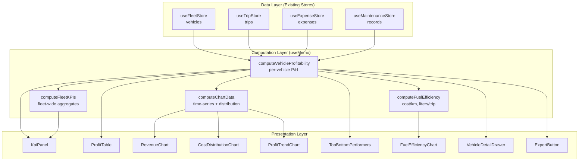

# Design Document: Profit Center

## Overview

The Profit Center is a read-only analytics dashboard page at `/profit-center` that computes per-vehicle profitability from existing Zustand stores. It aggregates revenue (trip fares) against all expense categories (fuel, maintenance, driver pay, helper fees, tolls, other) on a per-vehicle basis with time period filtering, fleet-wide KPIs, visual charts (recharts), a sortable/searchable profitability table, a vehicle detail drawer, and CSV export.

**Key design principle:** No new stores. All data is derived on the fly using `useMemo` from `useFleetStore`, `useTripStore`, `useExpenseStore`, and `useMaintenanceStore`. Local UI state (selected period, sort, search, drawer state) uses React `useState`.

## Architecture



**Data flow:** Stores → `useMemo` computation functions → UI components. Period filter state drives recomputation via dependency arrays. No side effects, no async operations beyond initial hydration.

## Components and Interfaces

### File Structure

```
app/(app)/profit-center/
  page.tsx                          # Main page component, orchestrates layout

components/profit-center/
  PeriodFilter.tsx                  # Date period selector (presets + custom range)
  KpiPanel.tsx                      # Fleet-wide KPI cards row
  ProfitTable.tsx                   # Sortable, searchable per-vehicle table
  VehicleDetailDrawer.tsx           # Slide-over detail breakdown
  RevenueExpensesChart.tsx          # Line/bar chart: revenue vs expenses over time
  CostDistributionChart.tsx         # Donut chart: expense category breakdown
  ProfitTrendChart.tsx              # Area chart: net profit over time
  TopBottomPerformers.tsx           # Top 5 / Bottom 5 vehicle cards
  FuelEfficiencyChart.tsx           # Horizontal bar chart: cost/km per vehicle
  ExportButton.tsx                  # CSV export trigger

lib/profit-center/
  computations.ts                   # Pure computation functions (useMemo targets)
  types.ts                          # Local types for profit center data shapes
  export-csv.ts                     # CSV generation utility
```

### Key Interfaces (lib/profit-center/types.ts)

```typescript
export type PeriodPreset = "this_week" | "this_month" | "this_quarter" | "custom";

export interface DateRange {
  start: Date;
  end: Date;
}

export interface VehicleProfitability {
  vehicleId: string;
  plate: string;
  type: string;
  brand: string;
  model: string;
  revenue: number;
  fuelCost: number;
  maintenanceCost: number;
  driverPay: number;
  helperFees: number;
  otherCosts: number;       // tolls + cash_advance + other expenses + trip otherFees
  totalExpenses: number;    // sum of all cost categories
  netProfit: number;        // revenue - totalExpenses
  margin: number | null;    // (netProfit / revenue) * 100, null when revenue = 0
  tripCount: number;
  totalDistanceKm: number;
  fuelLiters: number;
  costPerKm: number | null; // fuelCost / totalDistanceKm, null when distance = 0
  litersPerTrip: number | null; // fuelLiters / tripCount, null when tripCount = 0
}

export interface FleetKPIs {
  totalRevenue: number;
  totalExpenses: number;
  netProfit: number;
  profitMargin: number | null;
  activeVehicleCount: number;
  // Period-over-period comparison
  revenueDelta: number | null;     // % change vs previous period
  expenseDelta: number | null;
  profitDelta: number | null;
  marginDelta: number | null;
}

export interface ChartDataPoint {
  label: string;          // e.g. "Jun 1–7" or "June"
  startDate: Date;
  endDate: Date;
  revenue: number;
  expenses: number;
  netProfit: number;
}

export interface CostCategory {
  name: string;           // "Fuel", "Maintenance", etc.
  amount: number;
  percentage: number;
  color: string;
}

export type SortColumn = 
  | "plate" | "revenue" | "fuelCost" | "maintenanceCost" 
  | "driverPay" | "helperFees" | "otherCosts" 
  | "totalExpenses" | "netProfit" | "margin";

export type SortDirection = "asc" | "desc";
```

### Core Computation Functions (lib/profit-center/computations.ts)

```typescript
/**
 * Computes profitability for all eligible vehicles in the given period.
 * Pure function — suitable for useMemo.
 */
export function computeVehicleProfitability(
  vehicles: Vehicle[],
  trips: Trip[],
  expenses: Expense[],
  maintenance: MaintenanceRecord[],
  dateRange: DateRange
): VehicleProfitability[];

/**
 * Aggregates vehicle-level profitability into fleet KPIs.
 * Also computes period-over-period delta when previousPeriodData is provided.
 */
export function computeFleetKPIs(
  vehicleData: VehicleProfitability[],
  previousPeriodData?: VehicleProfitability[]
): FleetKPIs;

/**
 * Groups profitability data into time-series chart data points.
 * Uses weekly buckets for periods <= 31 days, monthly for longer.
 */
export function computeChartData(
  trips: Trip[],
  expenses: Expense[],
  maintenance: MaintenanceRecord[],
  dateRange: DateRange
): ChartDataPoint[];

/**
 * Computes expense distribution by category across the fleet.
 */
export function computeCostDistribution(
  vehicleData: VehicleProfitability[]
): CostCategory[];

/**
 * Returns the previous equivalent period for comparison.
 * E.g., if current is Jun 1-30, previous is May 1-31.
 */
export function getPreviousPeriod(dateRange: DateRange): DateRange;

/**
 * Determines aggregation granularity based on period length.
 */
export function getAggregationGranularity(dateRange: DateRange): "weekly" | "monthly";
```

### Page Component (page.tsx) — Orchestration Pattern

```typescript
"use client";
export default function ProfitCenterPage() {
  // ── UI State ──
  const [period, setPeriod] = useState<PeriodPreset>("this_month");
  const [customRange, setCustomRange] = useState<DateRange | null>(null);
  const [sortColumn, setSortColumn] = useState<SortColumn>("netProfit");
  const [sortDir, setSortDir] = useState<SortDirection>("desc");
  const [search, setSearch] = useState("");
  const [selectedVehicle, setSelectedVehicle] = useState<string | null>(null);
  const [page, setPage] = useState(0);
  const [pageSize, setPageSize] = useState(10);

  // ── Store Data ──
  const vehicles = useFleetStore((s) => s.vehicles);
  const trips = useTripStore((s) => s.trips);
  const expenses = useExpenseStore((s) => s.expenses);
  const maintenance = useMaintenanceStore((s) => s.records);

  // ── Derived Date Range ──
  const dateRange = useMemo(() => resolveDateRange(period, customRange), [period, customRange]);
  const prevRange = useMemo(() => getPreviousPeriod(dateRange), [dateRange]);

  // ── Core Computations ──
  const vehicleData = useMemo(
    () => computeVehicleProfitability(vehicles, trips, expenses, maintenance, dateRange),
    [vehicles, trips, expenses, maintenance, dateRange]
  );
  const prevVehicleData = useMemo(
    () => computeVehicleProfitability(vehicles, trips, expenses, maintenance, prevRange),
    [vehicles, trips, expenses, maintenance, prevRange]
  );
  const fleetKPIs = useMemo(
    () => computeFleetKPIs(vehicleData, prevVehicleData),
    [vehicleData, prevVehicleData]
  );
  // ... chart data, sorted/filtered table data, etc.
}
```

## Data Models

No new persistent data models are introduced. All data is derived from existing store types:

| Source Store | Fields Used | Purpose |
|---|---|---|
| `useFleetStore` → `Vehicle` | id, plate, type, brand, model, status | Vehicle identity & filtering |
| `useTripStore` → `Trip` | vehicleId, fare, driverRate, helperFee, otherFees, distanceKm, status, createdAt | Revenue, driver/helper costs, distances |
| `useExpenseStore` → `Expense` | vehicleId, category, amount, liters, date | Fuel, tolls, cash advances, other costs |
| `useMaintenanceStore` → `MaintenanceRecord` | vehicleId, cost, status, completedAt | Maintenance costs |

### Filtering Logic

- **Trips**: included when `status ∈ ["delivered", "completed"]` AND `createdAt` falls within period
- **Expenses**: included when `date` falls within period
- **Maintenance**: included when `status === "completed"` AND `completedAt` falls within period
- **Vehicles**: included when `status ∈ ["available", "in_trip", "maintenance"]` OR vehicle has a qualifying trip in the period

### Computation Formulas

| Metric | Formula |
|---|---|
| Revenue | `Σ trip.fare` (filtered trips for vehicle) |
| Fuel Cost | `Σ expense.amount` where category = "fuel" |
| Maintenance Cost | `Σ maintenance.cost ?? 0` where status = "completed" |
| Driver Pay | `Σ trip.driverRate` (where defined) |
| Helper Fees | `Σ trip.helperFee` (where defined) |
| Other Costs | `Σ expense.amount` (toll/cash_advance/other) + `Σ trip.otherFees[].amount` |
| Total Expenses | fuelCost + maintenanceCost + driverPay + helperFees + otherCosts |
| Net Profit | revenue − totalExpenses |
| Margin | revenue > 0 ? (netProfit / revenue) × 100 : null |
| Cost/km | totalDistanceKm > 0 ? fuelCost / totalDistanceKm : null |
| Liters/trip | tripCount > 0 ? totalFuelLiters / tripCount : null |

## Correctness Properties

*A property is a characteristic or behavior that should hold true across all valid executions of a system — essentially, a formal statement about what the system should do. Properties serve as the bridge between human-readable specifications and machine-verifiable correctness guarantees.*

### Property 1: Per-vehicle revenue/cost aggregation correctness

*For any* set of vehicles, trips, expenses, and maintenance records, and *for any* valid date range, the computed revenue for a vehicle SHALL equal the sum of `fare` from all trips where `vehicleId` matches, `status ∈ ["delivered", "completed"]`, and `createdAt` falls within the range; and each expense category total SHALL equal the sum of matching records filtered by vehicleId, category, and date within the range.

**Validates: Requirements 2.1, 2.2, 2.3, 2.4, 2.5, 2.6**

### Property 2: Profitability arithmetic invariants

*For any* computed `VehicleProfitability` record: (a) `totalExpenses` SHALL equal `fuelCost + maintenanceCost + driverPay + helperFees + otherCosts`; (b) `netProfit` SHALL equal `revenue - totalExpenses`; (c) when `revenue > 0`, `margin` SHALL equal `round((netProfit / revenue) * 100, 1)`, and when `revenue === 0`, `margin` SHALL be `null`.

**Validates: Requirements 2.7, 2.8, 2.9, 2.10**

### Property 3: Vehicle inclusion filtering

*For any* set of vehicles with varying statuses, `computeVehicleProfitability` SHALL include a vehicle if and only if its `status ∈ ["available", "in_trip", "maintenance"]` OR at least one trip with `vehicleId` matching that vehicle exists in the period with `status ∈ ["delivered", "completed"]`.

**Validates: Requirements 2.11**

### Property 4: Period date filtering correctness

*For any* date range and *for any* trip/expense/maintenance record, the record SHALL be included in computations if and only if the relevant date field (`createdAt` for trips, `date` for expenses, `completedAt` for maintenance) falls within the inclusive start/end bounds of the selected period.

**Validates: Requirements 4.4, 4.5**

### Property 5: Table sorting correctness

*For any* set of vehicle profitability data and *for any* sort column and direction, the resulting array SHALL be ordered such that for all adjacent pairs (a, b), `a[column] <= b[column]` when ascending, or `a[column] >= b[column]` when descending.

**Validates: Requirements 5.2**

### Property 6: Search filtering correctness

*For any* search query string and *for any* set of vehicles, the filtered result SHALL include a vehicle if and only if its `plate` field contains the query as a case-insensitive substring.

**Validates: Requirements 5.6**

### Property 7: Pagination slicing correctness

*For any* dataset of N vehicles, page index P, and page size S, the displayed subset SHALL contain exactly `min(S, N - P*S)` items starting at index `P*S`, and the total page count SHALL equal `ceil(N / S)`.

**Validates: Requirements 5.8**

### Property 8: Fuel efficiency metric formulas

*For any* vehicle with computed fuel data: (a) when `totalDistanceKm > 0`, `costPerKm` SHALL equal `fuelCost / totalDistanceKm`; (b) when `totalDistanceKm === 0`, `costPerKm` SHALL be `null`; (c) when `tripCount > 0`, `litersPerTrip` SHALL equal `fuelLiters / tripCount`; (d) when `tripCount === 0`, `litersPerTrip` SHALL be `null`.

**Validates: Requirements 6.6, 6.7, 11.2, 11.3, 11.5, 11.6**

### Property 9: Top/Bottom performer selection

*For any* set of vehicle profitability data sorted by `netProfit`, the "Top Performers" list SHALL contain the min(5, N) vehicles with the highest `netProfit` values in descending order, and the "Bottom Performers" list SHALL contain the min(5, N) vehicles with the lowest `netProfit` values in ascending order (most negative first).

**Validates: Requirements 10.1, 10.2, 10.5**

### Property 10: CSV export content correctness

*For any* set of vehicle profitability data, the generated CSV SHALL contain exactly one data row per vehicle plus one summary row, and each cell value SHALL match the corresponding `VehicleProfitability` field for that vehicle (revenue, fuelCost, maintenanceCost, driverPay, helperFees, otherCosts, totalExpenses, netProfit, margin).

**Validates: Requirements 12.2, 12.3**

### Property 11: Fleet KPI totals equal sum of vehicle values

*For any* set of `VehicleProfitability` records, `fleetKPIs.totalRevenue` SHALL equal `Σ vehicle.revenue`, `fleetKPIs.totalExpenses` SHALL equal `Σ vehicle.totalExpenses`, and `fleetKPIs.netProfit` SHALL equal `totalRevenue - totalExpenses`.

**Validates: Requirements 3.2, 3.3, 3.4, 5.10**

### Property 12: Aggregation granularity determination

*For any* date range, when the range spans 31 days or fewer, `getAggregationGranularity` SHALL return `"weekly"`; when the range spans more than 31 days, it SHALL return `"monthly"`.

**Validates: Requirements 7.2, 9.2**

## Error Handling

| Scenario | Handling |
|---|---|
| Zero revenue for a vehicle | Display margin as "N/A" (null in data model) |
| Zero total distance | Display cost/km as "N/A" |
| Zero trip count | Display liters/trip as "N/A" |
| Zero fleet revenue | Display fleet margin as "N/A" |
| Empty period (no data) | KPIs show ₱0.00, charts show empty state message, table shows zero rows with illustration |
| Fewer than 2 chart data points | Show "Not enough data to show trends" message instead of chart |
| Fewer than 5 vehicles for performers | Show only available vehicles |
| No data for export | Show informational toast, skip file generation |
| `maintenance.cost` is undefined | Treat as 0 in sum |
| `trip.otherFees` is undefined | Treat as empty array |
| `trip.driverRate` / `trip.helperFee` undefined | Skip from respective sums |
| `expense.liters` undefined | Skip from liters total for that vehicle |

All error states produce graceful UI fallbacks — no thrown errors, no broken renders. Computation functions are null-safe by design using optional chaining and nullish coalescing.

## Testing Strategy

### Property-Based Tests (fast-check)

The feature's pure computation functions (`lib/profit-center/computations.ts`) are ideal candidates for property-based testing. They are pure functions with clear input/output behavior, operate over large input spaces (varying trip counts, expense amounts, date ranges), and have universal invariants.

**Library:** [fast-check](https://github.com/dubzzz/fast-check) (already available or easily added as dev dependency)

**Configuration:**
- Minimum 100 iterations per property
- Each test tagged with: `// Feature: profit-center, Property {N}: {title}`

**Property tests cover:**
- `computeVehicleProfitability` — aggregation correctness (Property 1)
- Arithmetic invariants on output (Property 2)
- Vehicle inclusion logic (Property 3)
- Date filtering (Property 4)
- Sort/search/pagination utilities (Properties 5, 6, 7)
- Fuel efficiency metrics (Property 8)
- Top/bottom performer selection (Property 9)
- CSV generation (Property 10)
- Fleet KPI aggregation (Property 11)
- Granularity determination (Property 12)

### Unit Tests (vitest)

Example-based tests for:
- Specific known vehicle scenarios (concrete numbers, verify exact outputs)
- Edge cases: zero revenue, zero distance, no trips, undefined fields
- Period filter presets resolve to correct date ranges
- `formatCurrency` integration (verify correct locale formatting)
- Component rendering (KPI cards render correct values, table renders columns)

### Integration Tests

- Full page render at `/profit-center` — verifies routing and no crash
- Period filter interaction — changing period updates all sections
- Table sorting interaction — click column header, verify order changes
- Drawer open/close — click row, verify drawer content, close via Escape
- Export flow — click export, verify toast notification

### Accessibility Audit

- Manual testing with screen reader (NVDA/VoiceOver)
- Keyboard navigation walkthrough
- axe-core automated scan on rendered page
