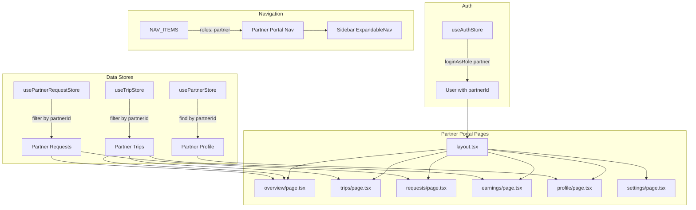

# Design Document: Subcon Partner Portal

## Overview

The Subcon Partner Portal introduces a self-service web portal for subcontractor/partner users. It follows the established portal pattern (Client Portal, Driver Portal) to provide partners with visibility into their assigned trips, funding requests, earnings, and company profile — all scoped to their own data via `partnerId`.

The implementation extends the existing role-based architecture by adding a "partner" role to the type system, navigation, login page, and creating a new `app/(app)/partner-portal/` route group with six sub-pages: Overview, Trips, Requests, Earnings, Profile, and Settings.

**Key Design Decisions:**
- Reuse existing Zustand stores (`useTripStore`, `usePartnerStore`, `usePartnerRequestStore`) — no new stores needed
- Follow the Client Portal layout and Sidebar expandable nav pattern exactly
- All data filtering happens client-side by matching `user.partnerId` against store records
- Read-only profile (no self-edit) — partners contact admin for changes
- Payout calculation uses a 3-tier precedence: `partnerRate` → `defaultRate` → `ratePerKm × distanceKm`

## Architecture



### Data Flow

1. User authenticates as "partner" → `useAuthStore` returns user with `partnerId`
2. Each portal page reads from shared stores, filtering by `user.partnerId`
3. Requests page writes new requests via `usePartnerRequestStore.addRequest()` with `partnerId` pre-filled
4. No server-side data fetching — all state is client-side via Zustand persist middleware

## Components and Interfaces

### Files to Modify

| File | Change |
|------|--------|
| `lib/types.ts` | Add `"partner"` to `Role` union; add `partnerId?: string` to `User` |
| `lib/auth/roles.ts` | Add partner NAV_ITEMS entry, ROLE_LABEL, DEFAULT_LANDING |
| `lib/data/users.ts` | Add seed partner user (id: `u-008`, partnerId: `ptn-001`) |
| `app/(auth)/login/page.tsx` | Add role card + quick access entry |
| `components/layout/Sidebar.tsx` | Add `PARTNER_PORTAL_CHILDREN` array + expandable nav condition |

### Files to Create

| File | Purpose |
|------|---------|
| `app/(app)/partner-portal/layout.tsx` | Portal layout with heading + subtitle |
| `app/(app)/partner-portal/page.tsx` | Redirect to `/partner-portal/overview` |
| `app/(app)/partner-portal/overview/page.tsx` | Dashboard with KPIs, recent trips, quick links |
| `app/(app)/partner-portal/trips/page.tsx` | Trip list + filters + search + detail panel |
| `app/(app)/partner-portal/requests/page.tsx` | Request list + new request form + filters |
| `app/(app)/partner-portal/earnings/page.tsx` | Earnings KPIs + payout table + status filter |
| `app/(app)/partner-portal/profile/page.tsx` | Read-only partner profile with masked banking |
| `app/(app)/partner-portal/settings/page.tsx` | Settings with notification toggles + logout |

### Component Hierarchy

```
partner-portal/layout.tsx
├── overview/page.tsx
│   ├── KpiCard (×4: Total Trips, Active, Completed, Pending Payables)
│   ├── RecentTripsTable (last 5 trips)
│   ├── PendingRequestsSummary (count + total ₱)
│   └── QuickLinkCards (×4: Trips, Requests, Earnings, Profile)
├── trips/page.tsx
│   ├── StatusFilterTabs (All | Active | Completed | Cancelled)
│   ├── SearchInput
│   ├── TripListTable
│   └── TripDetailPanel (slide-over or modal)
├── requests/page.tsx
│   ├── StatusFilterTabs (All | Pending | Approved | Rejected | Released)
│   ├── NewRequestButton → NewRequestDialog
│   │   └── Form (type select, amount input, reason textarea)
│   └── RequestListTable
├── earnings/page.tsx
│   ├── KpiCard (×4: Total Earnings, Paid, Pending, Trips Completed)
│   ├── PayoutStatusFilter (All | Pending | Paid)
│   └── PayoutTable
├── profile/page.tsx
│   ├── CompanyInfoCard (name, contact, phone, email, address, TIN, vehicles)
│   ├── BankingCard (bank name, masked account)
│   ├── RatesCard (defaultRate, ratePerKm)
│   └── StatusBadge
└── settings/page.tsx
    ├── ProfileSection (name, email, phone)
    ├── NotificationToggles
    └── LogOutButton
```

### Sidebar Integration

Add `PARTNER_PORTAL_CHILDREN` to `Sidebar.tsx`:

```typescript
const PARTNER_PORTAL_CHILDREN = [
  { label: "Overview", href: "/partner-portal/overview", icon: LayoutGrid },
  { label: "My Trips", href: "/partner-portal/trips", icon: Truck },
  { label: "Requests", href: "/partner-portal/requests", icon: Receipt },
  { label: "Earnings", href: "/partner-portal/earnings", icon: Wallet },
  { label: "Profile", href: "/partner-portal/profile", icon: User },
  { label: "Settings", href: "/partner-portal/settings", icon: Settings },
];
```

The `ExpandableNav` component will be conditionally rendered when `item.href === "/partner-portal"`, matching the existing pattern for client-portal and billing.

### NAV_ITEMS Entry

```typescript
{ label: "Partner Portal", href: "/partner-portal", icon: Handshake, group: "customer", roles: ["partner"] },
```

## Data Models

### Type Extensions

```typescript
// lib/types.ts - Role union addition
export type Role =
  | "super_admin"
  | "company_admin"
  | "dispatcher"
  | "driver"
  | "helper"
  | "accounting"
  | "client"
  | "partner";  // NEW

// lib/types.ts - User interface addition
export interface User {
  // ... existing fields
  partnerId?: string;  // NEW: when role is "partner"
}
```

### Existing Types Used (no modifications)

```typescript
// Already in lib/types.ts
interface Trip {
  partnerId?: string;
  partnerPayoutStatus?: PartnerPayoutStatus; // "pending" | "paid"
  partnerPayoutAt?: string;
  partnerRate?: number;
  // ... other fields
}

interface Partner {
  id: string;
  name: string;
  contactPerson: string;
  phone: string;
  email: string;
  address: string;
  tin?: string;
  bankName?: string;
  bankAccountNo?: string;
  vehicleTypes: string[];
  defaultRate?: number;
  ratePerKm?: number;
  status: PartnerStatus;
  createdAt: string;
  notes?: string;
}

interface PartnerRequest {
  id: string;
  partnerId: string;
  type: PartnerRequestType; // "diesel" | "cash_advance" | "other"
  amount: number;
  reason?: string;
  requestedAt: string;
  status: PartnerRequestStatus; // "pending" | "approved" | "rejected" | "released"
  reviewedBy?: string;
  reviewedAt?: string;
  releaseReference?: string;
}
```

### Seed Data Addition

```typescript
// lib/data/users.ts - new seed user
{
  id: "u-008",
  name: "Northbound Trucking",
  email: "partner@nexlogistics.demo",
  role: "partner",
  _demoPassword: "Partner123!",
  phone: "09171234567",
  partnerId: "ptn-001",
}
```

### Payout Calculation Logic

```typescript
function computePayoutAmount(trip: Trip, partner: Partner): number {
  if (trip.partnerRate && trip.partnerRate > 0) return trip.partnerRate;
  if (partner.defaultRate && partner.defaultRate > 0) return partner.defaultRate;
  if (partner.ratePerKm && partner.ratePerKm > 0 && trip.distanceKm > 0) {
    return partner.ratePerKm * trip.distanceKm;
  }
  return 0;
}
```

### Bank Account Masking Logic

```typescript
function maskAccountNumber(accountNo: string): string {
  if (accountNo.length <= 4) return accountNo;
  return "*".repeat(accountNo.length - 4) + accountNo.slice(-4);
}
```

### Currency Formatting

```typescript
function formatPHP(amount: number): string {
  return new Intl.NumberFormat("en-PH", {
    style: "currency",
    currency: "PHP",
    minimumFractionDigits: 2,
    maximumFractionDigits: 2,
  }).format(amount);
}
```

## Correctness Properties

*A property is a characteristic or behavior that should hold true across all valid executions of a system — essentially, a formal statement about what the system should do. Properties serve as the bridge between human-readable specifications and machine-verifiable correctness guarantees.*

### Property 1: Role-based navigation filtering

*For any* role value, `navForRole(role)` shall return only NAV_ITEMS where the `roles` array is undefined OR includes that role. Specifically, for role "partner", all returned items must have "partner" in their roles array or have no roles restriction; and for any non-partner role, no item with href starting with "/partner-portal" shall be returned.

**Validates: Requirements 2.8, 10.4**

### Property 2: Partner data isolation

*For any* set of trips, requests, and partner records in the stores, the partner portal shall only display trips where `trip.partnerId === user.partnerId`, requests where `request.partnerId === user.partnerId`, and the profile where `partner.id === user.partnerId`. No data belonging to a different partnerId shall ever be visible.

**Validates: Requirements 4.5, 5.1, 7.7, 11.1, 11.2**

### Property 3: Payout amount precedence calculation

*For any* trip and partner combination, the computed payout amount shall equal: (1) `trip.partnerRate` if defined and > 0; otherwise (2) `partner.defaultRate` if defined and > 0; otherwise (3) `partner.ratePerKm × trip.distanceKm` if both are defined and > 0; otherwise (4) 0. No other computation path shall be used.

**Validates: Requirements 7.5**

### Property 4: Bank account number masking

*For any* bank account number string of length N ≥ 4, the masked output shall be a string of length N where the first N-4 characters are all asterisks ("*") and the last 4 characters match the original string's last 4 characters. For strings of length < 4, the original string is returned unmasked.

**Validates: Requirements 8.2**

### Property 5: Request validation and creation

*For any* request type in {"diesel", "cash_advance", "other"} and any amount > 0, submitting a new request shall succeed, producing a PartnerRequest with status "pending", the current user's partnerId, and a valid requestedAt timestamp. Conversely, *for any* submission where type is empty or amount ≤ 0, the system shall reject the submission and the request list shall remain unchanged.

**Validates: Requirements 6.3, 6.4, 6.5, 11.2**

### Property 6: Status filtering correctness

*For any* collection of items (trips or requests) and any selected status filter value, the filtered output shall contain exactly those items whose status matches the filter criteria. When filter is "all", all items shall be returned. The filter shall never add items not present in the source collection or exclude items that match the criteria.

**Validates: Requirements 5.3, 6.7, 7.3**

### Property 7: KPI computation correctness

*For any* set of trips belonging to a partner, the KPI values shall satisfy: (a) total trips = count of all trips with matching partnerId; (b) active trips = count of trips with status in {"scheduled", "driver_assigned", "vehicle_dispatched", "loaded", "in_transit", "delayed"}; (c) completed trips = count of trips with status "completed" or "delivered"; (d) pending payables = sum of computed payout amounts for trips where partnerPayoutStatus is "pending". For pending requests: count = number of requests with status "pending", total = sum of their amounts.

**Validates: Requirements 4.1, 4.3, 7.1**

### Property 8: Trip search case-insensitive partial matching

*For any* search query string and any set of trips, the search results shall contain exactly those trips where the query (lowercased) is a substring of trip ID (lowercased), pickup address (lowercased), or dropoff address (lowercased). No trip matching the criteria shall be excluded, and no trip failing all three checks shall be included.

**Validates: Requirements 5.4**

### Property 9: Profile field rendering with fallback

*For any* Partner object, the profile page shall display all required fields (name, contactPerson, phone, email, address, vehicleTypes). For optional fields (tin, bankName, bankAccountNo, defaultRate, ratePerKm), if the value is undefined/null/empty, the display shall show "—" (em dash); otherwise the actual value (or formatted value for rates) shall be displayed.

**Validates: Requirements 8.1, 8.6**

## Error Handling

| Scenario | Handling |
|----------|----------|
| User navigates to /partner-portal without partner role | `navForRole` excludes partner items; pages can check `user.role === "partner"` and redirect to login |
| `user.partnerId` doesn't match any Partner in store | Profile page shows empty/fallback; trips and requests show empty state |
| Trip has no partnerRate and partner has no rates configured | `computePayoutAmount` returns 0; displays ₱0.00 |
| Request form submitted with invalid data | Client-side validation prevents submission; toast error shown |
| Empty data states (no trips/requests) | Each page renders a friendly empty state message with appropriate icon |
| Optional bank/TIN fields missing | Display "—" character per requirement 8.6 |
| Store hydration delay (persist middleware) | Components use optional chaining; KPIs default to 0 until store hydrates |

## Testing Strategy

### Property-Based Tests (PBT)

**Library:** [fast-check](https://github.com/dubzzz/fast-check) (already standard for TypeScript/Next.js projects)

**Configuration:** Minimum 100 iterations per property test.

Each property from the Correctness Properties section maps to a single property-based test:

| Property | Test Focus | Generator Strategy |
|----------|-----------|-------------------|
| P1: Navigation filtering | Generate random role values, verify navForRole output | Arbitrary from Role union |
| P2: Data isolation | Generate trips/requests with mixed partnerIds, verify filtering | Arrays of Trip/PartnerRequest with random partnerIds |
| P3: Payout precedence | Generate trip+partner with varying rate fields | Object with optional partnerRate, defaultRate, ratePerKm, distanceKm |
| P4: Account masking | Generate random strings of varying lengths | Arbitrary strings (alphanumeric, with dashes) |
| P5: Request validation | Generate valid/invalid type+amount combos | Tuple of (type ∈ valid set, amount ∈ ℝ) |
| P6: Status filtering | Generate item arrays + filter selection | Array of items with random statuses + one status filter |
| P7: KPI computation | Generate trip arrays with various statuses/amounts | Array of Trip objects with random status, partnerPayoutStatus, rates |
| P8: Trip search | Generate trips + random search substring | Array of trips + arbitrary search string |
| P9: Profile fallback | Generate Partner objects with random optional fields undefined | Partner with fc.option() on optional fields |

**Tag format:** `Feature: subcon-partner-portal, Property {N}: {title}`

### Unit Tests (Example-Based)

- Login flow: `loginAsRole("partner")` returns user with valid partnerId
- ROLE_LABEL["partner"] === "Subcon Partner"
- DEFAULT_LANDING["partner"] === "/partner-portal/overview"
- Seed user exists with correct fields
- Quick access entry present in login page
- Layout renders heading "Partner Portal"
- Redirect from /partner-portal to /partner-portal/overview
- Status badge color mapping (pending→amber, approved→blue, rejected→red, released→green)
- Logout clears auth and redirects

### Integration Tests

- Full login → navigate → view trips flow
- Submit request → appears in list → filter shows it under "pending"
- Earnings page shows only completed/delivered trips for the partner
